# CredFlow

**An Undercollateralized lending Protocol powered by cross-chain credit scores.**

CredFlow turns rich financial signals into a portable **CredScore** (300–850) that unlocks **undercollateralized loans**. Connect a wallet and we reconstruct your full DeFi footprint — Aave and Morpho repay history, Alchemy transfer graphs, sybil-risk analysis, and **37 ML features** — in minutes. No on-chain history yet? Link a bank account via **Reclaim zkTLS** and get an accurate score from verified balance and capacity, the same way traditional credit uses cash-flow signals.

Once scored, you mint a soulbound **CredScore SBT** and borrow with less collateral than standard over-collateralized DeFi. **Five autonomous agents** power the rest of the application: underwriting and minting credit, syncing your score to every market where you might borrow, watching every open loan, liquidating bad debt, and tuning pool rates — so borrowers get a complete product, not a static score widget.

Borrowing is available on **Robinhood Chain testnet**, **Arbitrum Sepolia**, and **Base Sepolia**. Credit state travels cross-chain via **LayerZero V2** so one underwritten identity cannot double-borrow across markets.

---

## Contracts

Live deployment addresses. Click any address to open the chain explorer.

**Explorers**

| Chain | Chain ID | LayerZero EID | Explorer |
|-------|----------|---------------|----------|
| Robinhood Chain testnet (hub) | 46630 | 40451 | [explorer.testnet.chain.robinhood.com](https://explorer.testnet.chain.robinhood.com) |
| Arbitrum Sepolia (spoke) | 421614 | 40231 | [sepolia.arbiscan.io](https://sepolia.arbiscan.io) |
| Base Sepolia (spoke) | 84532 | 40245 | [sepolia.basescan.org](https://sepolia.basescan.org) |

Source of truth: `docs/addresses.json`, `docs/spoke-arbitrum-addresses.json`, `docs/spoke-base-addresses.json`.

### Hub — Robinhood Chain Testnet

| Contract | Role | Address |
|----------|------|---------|
| CredScoreSBT | ERC721 soulbound credit profile (score, sub-scores, loan status, SHAP CID) | [0x941380a70Be9322fE1bCa65D13343323c5824359](https://explorer.testnet.chain.robinhood.com/address/0x941380a70Be9322fE1bCa65D13343323c5824359) |
| CredScoreEngine | On-chain score formula + Reclaim attestation → mint/update SBT | [0xD8Eeb09C86b6A910DbBcB1D83020Bd4a8dBdAEEb](https://explorer.testnet.chain.robinhood.com/address/0xD8Eeb09C86b6A910DbBcB1D83020Bd4a8dBdAEEb) |
| CredFlowLending | Hub borrow / repay / liquidate; reads SBT for LTV tiers | [0xe7B1D8BeCE6D3F1F33a65f2534d1AB7E61a7382A](https://explorer.testnet.chain.robinhood.com/address/0xe7B1D8BeCE6D3F1F33a65f2534d1AB7E61a7382A) |
| CredFlowLP | USDG liquidity pool; tracks utilization for rate optimizer | [0x571DD8F69798BaE3b442077F566e83719F6827aa](https://explorer.testnet.chain.robinhood.com/address/0x571DD8F69798BaE3b442077F566e83719F6827aa) |
| CredFlowOApp | LayerZero hub — broadcasts score / loan / default / repaid to spokes | [0x3E39e65fAb3DBbD506c34c6c3a0e8e64994583b4](https://explorer.testnet.chain.robinhood.com/address/0x3E39e65fAb3DBbD506c34c6c3a0e8e64994583b4) |
| ChainlinkOracle | WETH/USD pricing for hub collateral checks | [0x0733e87b12c0466460c2eC99ade11C4e0ce542c3](https://explorer.testnet.chain.robinhood.com/address/0x0733e87b12c0466460c2eC99ade11C4e0ce542c3) |
| MockChainlinkFeed (WETH/USD) | Testnet price feed wired to hub oracle | [0xDE969d906510F98EDA7AFFA3F8D248169a74c2A4](https://explorer.testnet.chain.robinhood.com/address/0xDE969d906510F98EDA7AFFA3F8D248169a74c2A4) |
| USDG | Hub borrow asset (Robinhood testnet stablecoin) | [0x7E955252E15c84f5768B83c41a71F9eba181802F](https://explorer.testnet.chain.robinhood.com/address/0x7E955252E15c84f5768B83c41a71F9eba181802F) |
| WETH | Hub collateral token | [0x7943e237c7F95DA44E0301572D358911207852Fa](https://explorer.testnet.chain.robinhood.com/address/0x7943e237c7F95DA44E0301572D358911207852Fa) |
| LayerZero EndpointV2 | Official LZ endpoint on Robinhood testnet | [0x3aCAAf60502791D199a5a5F0B173D78229eBFe32](https://explorer.testnet.chain.robinhood.com/address/0x3aCAAf60502791D199a5a5F0B173D78229eBFe32) |

### Spoke — Arbitrum Sepolia

| Contract | Role | Address |
|----------|------|---------|
| CredFlowOApp | LZ spoke — mirrors score, loan lock, blacklist from hub | [0xebE2fDe0781ea6f57c1F5EDd775Fe8D41b9C6830](https://sepolia.arbiscan.io/address/0xebE2fDe0781ea6f57c1F5EDd775Fe8D41b9C6830) |
| CredFlowSpokeLending | Spoke borrow / repay; uses OApp as credit registry | [0xd834854Eb7d064EBb74cED270eb3431f7e816728](https://sepolia.arbiscan.io/address/0xd834854Eb7d064EBb74cED270eb3431f7e816728) |
| CredFlowLP | USDC liquidity pool on Arbitrum Sepolia | [0x60BD7ca901f6F23ac0A4D640B3DEeCEDc9135483](https://sepolia.arbiscan.io/address/0x60BD7ca901f6F23ac0A4D640B3DEeCEDc9135483) |
| ChainlinkOracle | Spoke collateral pricing wrapper | [0x08f18d1257C8665fe6DAD689B8E1Acd9120C374b](https://sepolia.arbiscan.io/address/0x08f18d1257C8665fe6DAD689B8E1Acd9120C374b) |
| ChainlinkMirrorFeed (WETH/USD) | Mainnet ETH/USD mirrored to testnet | [0xb0cc4Fbe99f7426b5b345008944a23F0db54Bdd6](https://sepolia.arbiscan.io/address/0xb0cc4Fbe99f7426b5b345008944a23F0db54Bdd6) |
| WETH | Spoke collateral token | [0x1dF462e2712496373A347f8ad10802a5E95f053D](https://sepolia.arbiscan.io/address/0x1dF462e2712496373A347f8ad10802a5E95f053D) |
| USDC | Spoke borrow asset | [0x75faf114eafb1BDbe2F0316DF893fd58CE46AA4d](https://sepolia.arbiscan.io/address/0x75faf114eafb1BDbe2F0316DF893fd58CE46AA4d) |
| Mainnet Chainlink ETH/USD (mirror source) | Price source pushed to spoke feed | [0x639Fe6ab55C921f74e7fac1ee960C0B6293ba612](https://arbiscan.io/address/0x639Fe6ab55C921f74e7fac1ee960C0B6293ba612) |
| CredScoreSBT | Not deployed on spokes (hub only) | — |

### Spoke — Base Sepolia

| Contract | Role | Address |
|----------|------|---------|
| CredFlowOApp | LZ spoke — mirrors score, loan lock, blacklist from hub | [0xB830EC92c606f3ECF03d9fE223F873dA2dbd2620](https://sepolia.basescan.org/address/0xB830EC92c606f3ECF03d9fE223F873dA2dbd2620) |
| CredFlowSpokeLending | Spoke borrow / repay; uses OApp as credit registry | [0x99269E64c4Dfb227648E079Bf34E6857B6c300A4](https://sepolia.basescan.org/address/0x99269E64c4Dfb227648E079Bf34E6857B6c300A4) |
| CredFlowLP | USDC liquidity pool on Base Sepolia | [0x48F669f0AA0271Ef56471841a0BfDED2A71aAc13](https://sepolia.basescan.org/address/0x48F669f0AA0271Ef56471841a0BfDED2A71aAc13) |
| ChainlinkOracle | Spoke collateral pricing wrapper | [0xFed19b2508ac23dDadAE680C005152FC4DE73368](https://sepolia.basescan.org/address/0xFed19b2508ac23dDadAE680C005152FC4DE73368) |
| ChainlinkMirrorFeed (WETH/USD) | Mainnet ETH/USD mirrored to testnet | [0x76B27936a660C9BC0b25Cb0dF86F394F0dd840F2](https://sepolia.basescan.org/address/0x76B27936a660C9BC0b25Cb0dF86F394F0dd840F2) |
| WETH | Canonical Base Sepolia WETH | [0x4200000000000000000000000000000000000006](https://sepolia.basescan.org/address/0x4200000000000000000000000000000000000006) |
| USDC | Spoke borrow asset | [0x036CbD53842c5426634e7929541eC2318f3dCF7e](https://sepolia.basescan.org/address/0x036CbD53842c5426634e7929541eC2318f3dCF7e) |
| Mainnet Chainlink ETH/USD (mirror source) | Price source pushed to spoke feed | [0x71041dddad3595F9CEd3DcCFBe3D1F4b0a16Bb70](https://basescan.org/address/0x71041dddad3595F9CEd3DcCFBe3D1F4b0a16Bb70) |
| CredScoreSBT | Not deployed on spokes (hub only) | — |

---

## Table of Contents

1. [Introduction](#introduction)
   - [Why Robinhood Chain Testnet](#why-robinhood-chain-testnet)
   - [Current Scenario](#current-scenario)
   - [The CredFlow Solution](#the-credflow-solution)
   - [System Architecture](#system-architecture)
   - [Full Borrower Journey](#full-borrower-journey)
2. [The Five Agents](#the-five-agents)
   - [Underwriter Agent](#underwriter-agent)
   - [Cross-Chain Sync Agent](#cross-chain-sync-agent)
   - [Portfolio Monitor Agent](#portfolio-monitor-agent)
   - [Liquidation Agent](#liquidation-agent)
   - [Rate Optimizer Agent](#rate-optimizer-agent)
   - [Agent Scheduler and Triggers](#agent-scheduler-and-triggers)
   - [Agent Lifecycle Map](#agent-lifecycle-map)
   - [Groq LLM Decision Layer](#groq-llm-decision-layer)
3. [Credit Scoring System](#credit-scoring-system)
   - [End-to-End Pipeline](#end-to-end-pipeline)
   - [Alchemy Wallet Data](#alchemy-wallet-data)
   - [Multi-Protocol Indexer](#multi-protocol-indexer)
   - [Reclaim Protocol (zkTLS Bank Balance)](#reclaim-protocol-zktls-bank-balance)
   - [XGBoost Model](#xgboost-model)
   - [All 37 Model Features](#all-37-model-features)
   - [R-GCN Sybil Detection](#r-gcn-sybil-detection)
   - [Underwriter and SBT Mint](#underwriter-and-sbt-mint)
4. [Borrowing Logic](#borrowing-logic)
   - [Collateral and LTV Tiers](#collateral-and-ltv-tiers)
   - [Hub vs Spoke Borrow](#hub-vs-spoke-borrow)
   - [Post-Borrow LayerZero Sync](#post-borrow-layerzero-sync)
5. [Repayment Logic](#repayment-logic)
   - [On-Chain Repay](#on-chain-repay)
   - [Post-Repay Pipeline](#post-repay-pipeline)
   - [LayerZero Unlock](#layerzero-unlock)
6. [Scenario: Price Goes Down](#scenario-price-goes-down)
   - [LTV Monitoring](#ltv-monitoring)
   - [Portfolio Monitor Agent in Action](#portfolio-monitor-agent-in-action)
   - [Health Warnings](#health-warnings)
   - [Liquidation Agent and LayerZero Default](#liquidation-agent-and-layerzero-default)
7. [Scenario: Default and Overdue Loans](#scenario-default-and-overdue-loans)
   - [Calendar Overdue vs On-Chain Enforcement](#calendar-overdue-vs-on-chain-enforcement)
   - [Grace Period and Portfolio Monitor](#grace-period-and-portfolio-monitor)
   - [Liquidation Agent and Cross-Chain Blacklist](#liquidation-agent-and-cross-chain-blacklist)
8. [LayerZero Cross-Chain Messaging](#layerzero-cross-chain-messaging)
   - [Why LayerZero](#why-layerzero)
   - [Cross-Chain Credit Topology](#cross-chain-credit-topology)
   - [CredFlowOApp Contract](#credflowoapp-contract)
   - [Message Types and Spoke State](#message-types-and-spoke-state)
   - [Message Flow by Lifecycle Event](#message-flow-by-lifecycle-event)
   - [Crosschain Sync Agent as Broadcaster](#crosschain-sync-agent-as-broadcaster)
   - [Options Encoding and Fees](#options-encoding-and-fees)
   - [Peer Wiring and DVNs](#peer-wiring-and-dvns)
   - [Delivery Latency and Stale Locks](#delivery-latency-and-stale-locks)
9. [Contracts Overview](#contracts-overview)
10. [Agent-Contract Interaction Matrix](#agent-contract-interaction-matrix)
11. [Conclusion](#conclusion)

---

## Introduction

CredFlow is a **credit-first lending product**. The experience starts with knowing the borrower — not with picking a chain or pooling liquidity.

**For experienced Web3 users**, we ingest an unusually deep wallet picture: multi-protocol borrow and repay events (Aave V3, Morpho Blue, CredFlow itself), Alchemy-powered transfer graphs, activity windows, liquidation history, and graph-based sybil detection. That becomes a FICO-like CredScore with SHAP explainability on IPFS.

**For users new to Web3**, the same product works without fabricated on-chain history. Optional **Reclaim zkTLS** bank verification adds verified balance and capacity into the on-chain score formula — so thin wallets are not automatically rejected.

Once approved, the score is committed as a **CredScore SBT** and drives real loan terms: LTV tiers, interest rates, and collateral requirements far below typical 150%+ DeFi over-collateralization. **Five Python agents** run everything that should not require manual ops — mint and update credit on-chain, propagate score and loan state across chains, poll health every five minutes, liquidate defaults and blacklist sybil rings, and adjust pool rates as utilization shifts.

The main UI uses a **server-side wallet** (`FRONTEND_PRIVATE_KEY` in `frontend/.env.local`) — the Next.js backend signs score, mint, borrow, and repay transactions. Legacy panels still reference wagmi/MetaMask, but the primary tabs (`AppShell`) route through `/api/wallet` and `/api/profile`.

### Why Robinhood Chain Testnet

Robinhood Chain is a **permissionless, EVM-compatible Layer-2** built on **Arbitrum** technology. It is designed for financial-grade on-chain infrastructure: tokenized real-world assets (equities, ETFs, private assets), 24/7 trading, self-custody via Robinhood Wallet, and bridging into Ethereum DeFi liquidity.

CredFlow anchors **on-chain credit issuance** on Robinhood testnet — where the CredScore SBT lives and where the underwriter agent mints and updates borrower profiles — for concrete technical reasons:

| Capability | How CredFlow uses it |
|------------|---------------------|
| **EVM compatibility** | Standard Hardhat/ethers/viem tooling; same contract patterns as Arbitrum/Base spokes |
| **Arbitrum L2 stack** | Low-cost transactions for SBT mints, agent broadcasts, and frequent scoring commits |
| **Native USDG + WETH** | USDG (`0x7E955…`) is the hub borrow asset; WETH (`0x7943…`) is collateral — both [documented officially](https://docs.robinhood.com/chain/contracts/) |
| **Official LayerZero V2** | Robinhood testnet is an officially supported LZ chain (EID **40451**, EndpointV2 deployed by LayerZero Labs) — no custom endpoint deployment required |
| **Faucet ecosystem** | Native ETH gas + Paxos USDG faucet for testnet liquidity |
| **RWA / lending focus** | Robinhood positions the chain for decentralized lending and tokenized assets — aligned with CredFlow's credit-scoring lending model |
| **Bridge to Ethereum DeFi** | The same CredScore that gates Robinhood borrowing also syncs to Arbitrum and Base — where users already have Aave/Morpho history indexed into their score |

Chain parameters: **Chain ID 46630**, RPC `https://rpc.testnet.chain.robinhood.com`, explorer `explorer.testnet.chain.robinhood.com`.

### Current Scenario

Traditional DeFi lending is **over-collateralized**: you post more collateral than you borrow, regardless of your repayment history. That model works for permissionless pools but fails for credit that actually reflects who you are as a borrower:

1. **Thin or empty wallet history** — new wallets have no signal; bots can fabricate minimal activity. CredFlow's bank path (Reclaim) and deep wallet indexing address both extremes.
2. **No portable credit** — repaying on Arbitrum does not help you borrow on Base or Robinhood unless something carries your score with you.
3. **Siloed risk** — each chain's lending pool cannot see loans active elsewhere, enabling double-borrows against the same identity.
4. **Off-chain capacity ignored** — bank balance and income are invisible unless cryptographically verified and folded into the score.

Borrowers with strong multi-protocol repayment behavior still face 150%+ collateral requirements. There is no cross-chain credit report that travels with the wallet — and no product that treats **wallet depth + optional bank proof + automated enforcement** as one system.

### The CredFlow Solution

CredFlow connects deep credit intelligence to automated loan operations:

1. **Wallet-native credit report** — Indexers pull Aave V3, Morpho Blue, CredFlow loan history, and Alchemy wallet telemetry across Arbitrum, Base, and Robinhood testnet. An XGBoost model scores default probability; R-GCN sybil detection flags wash trading and linked-wallet fraud. SHAP explanations land on IPFS for transparency.

2. **Bank path for Web3 newcomers** — Reclaim Protocol verifies bank balance through zkTLS without exposing credentials. The on-chain score formula blends ML default risk with verified off-chain capacity so thin wallets are not automatically rejected.

3. **Portable CredScore SBT** — Approved borrowers mint a soulbound token storing score, sub-scores, loan status, and blacklist state. One underwritten identity, one credit record.

4. **Undercollateralized borrowing** — Score maps to LTV tiers (40–85%) and rate tiers. Borrow USDG on Robinhood testnet or USDC on Arbitrum/Base with collateral requirements far below standard DeFi norms.

5. **Five agents, always on** — The underwriter commits credit on-chain. Cross-chain sync keeps every lending market aligned with your latest score and loan state. Portfolio monitor watches LTV and overdue grace. Liquidation agent seizes collateral, blacklists sybil rings, and broadcasts defaults. Rate optimizer adjusts pool pricing as utilization moves.

6. **Cross-chain credit sync** — LayerZero V2 propagates score updates, active-loan locks, repaid clears, and default blacklists from the authoritative credit registry to Arbitrum and Base lending contracts — preventing double-borrows and stale scores without duplicating underwriting on each chain.

- **Supabase** — persists profiles, score runs, loan events, and LayerZero broadcast audit rows.

### System Architecture

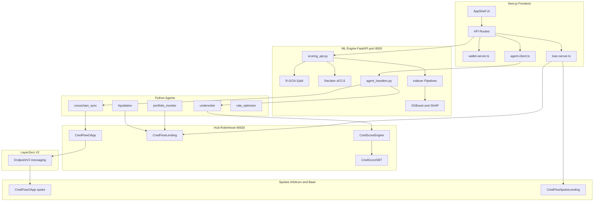

### Full Borrower Journey

From first score to repaid loan — every stage below is powered by the scoring pipeline (wallet + optional bank), on-chain SBT credit, and the five agents at the moments that matter:

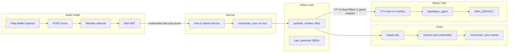

| Stage | User action | Contracts touched | Agents invoked |
|-------|-------------|-------------------|----------------|
| Prep | Run Aave/Morpho scripts | Spoke DeFi protocols | None |
| Score | Build Score | None (off-chain) | None (ML API only) |
| Score + LZ | Score completes | Hub OApp (via LZ) | `crosschain_sync` |
| Mint | Mint SBT | CredScoreEngine, CredScoreSBT | `underwriter` → `crosschain_sync` |
| Hub borrow | Borrow USDG | CredFlowLending, SBT | `crosschain_sync` (loan_active) |
| Spoke borrow | Borrow USDC | CredFlowSpokeLending, OApp read | None |
| Active loan | — | LTV checked on-chain | `portfolio_monitor`, `rate_optimizer` |
| Repay | Repay loan | CredFlowLending, SBT | scoring API → `underwriter` → `crosschain_sync` |
| Default | — (no user action) | liquidate, SBT default | `portfolio_monitor` → `liquidation_agent` → `crosschain_sync` |

---

## The Five Agents

CredFlow is **agent-driven**. Scoring computes a number; agents **act** on it — minting SBTs, signing LayerZero broadcasts, polling live LTV, liquidating bad loans, and tuning rates. Without them, the product would be a static score dashboard; with them, credit stays current and enforced across every chain for the entire borrower lifecycle.

| Agent | Product role |
|-------|----------------|
| **Underwriter** | Turns an approved score into on-chain credit — mints and updates the CredScore SBT |
| **Cross-chain sync** | Carries score, loan-active, repaid, and default state to every borrow market |
| **Portfolio monitor** | Watches every open loan for LTV breaches and calendar overdue |
| **Liquidation** | Seizes collateral, records defaults, blacklists sybil rings, triggers cross-chain default |
| **Rate optimizer** | Adjusts pool base rates as utilization shifts |

Agents live in `agents/`. HTTP endpoints mount on the ML API at `/agents/*` via `ml/agent_handlers.py`. Scheduled agents run through `npm run agents:serve` (`agents/scheduler.py`).

### Underwriter Agent

**File:** `agents/underwriter_agent.py`  
**Trigger:** Score mint (`POST /api/mint`), post-repay rescore, manual `POST /agents/underwrite`  
**Wallet:** `AGENT_PRIVATE_KEY` (same agent wallet as LZ broadcasts)

The underwriter is the **credit decision and on-chain commit** agent — the only agent that writes to `CredScoreSBT` and `CredScoreEngine`.

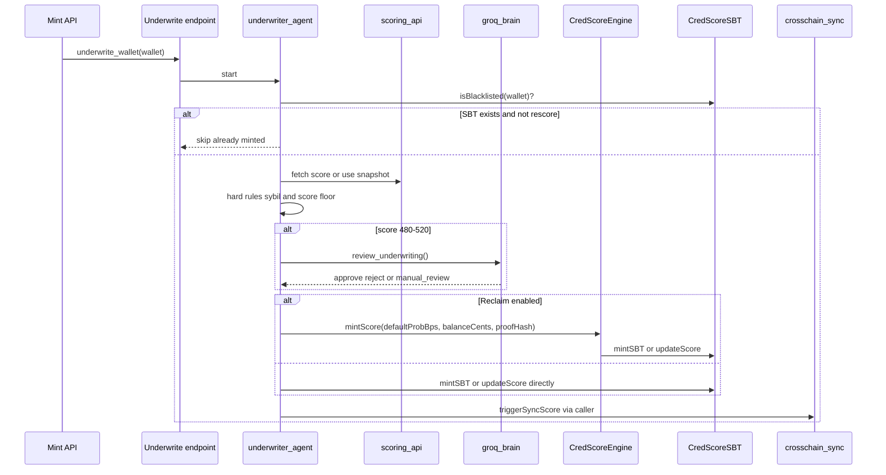

**`underwrite_wallet()` step-by-step:**

1. **`CredFlowAgent()`** — binds Web3 to hub RPC, SBT, Engine, lending addresses from `docs/addresses.json`.
2. **Blacklist check** — `sbt.isBlacklisted(wallet)` → immediate reject.
3. **Existence check** — `sbt.hasProfile(wallet)`; if true and `rescore=false`, return early with existing profile.
4. **Score fetch** — HTTP `POST /score` to local ML API, or accept `score_snapshot` from caller (post-repay pipeline passes fresh score to avoid duplicate indexer run).
5. **Hard rules (no Groq):**
   - `sybil_risk == "high"` → reject
   - `cred_score < 500` and not in borderline band → reject
   - `approved == false` from scoring API → reject
6. **Borderline band (480–520):** `review_underwriting()` sends wallet, score, sybil risk, feature summary to Groq (`llama-3.3-70b-versatile`). Returns `UnderwritingVerdict`: `approve`, `reject`, or `manual_review`. Fallback without API key: conservative reject.
7. **On-chain write:**
   - Reclaim path: `engine.mintScore(defaultProbBps, balanceUsdCents, reclaimProofHash, borrowSubScore, walletSubScore, shapCid)` — Engine computes final score on-chain and calls SBT.
   - No Reclaim: `sbt.mintSBT(wallet, score, …)` or `sbt.updateScore(wallet, score, …)` for rescore.
8. **Return** tx hashes + profile snapshot to caller; frontend then calls `triggerSyncScore()`.

The underwriter does **not** run on borrow — only on score/mint/rescore. Borrow only invokes `crosschain_sync`.

### Cross-Chain Sync Agent

**Files:** `agents/sync_service.py`, `agents/crosschain_sync.py`  
**Trigger:** Score complete, SBT mint, hub borrow, hub repay, scheduler batch catch-up

The crosschain_sync agent is CredFlow's **LayerZero messenger** — it is the only component that writes to hub `CredFlowOApp` broadcast functions. It uses `AGENT_PRIVATE_KEY` (must hold `AGENT_ROLE` + ETH for LZ fees).

| Function | LayerZero message | Triggered by |
|----------|-------------------|--------------|
| `broadcastScore` | `MSG_SCORE_UPDATE` (1) | `sync_wallet_score()` — after score/mint/rescore |
| `broadcastLoanActive` | `MSG_LOAN_ACTIVE` (2) | `sync_wallet_loan_active()` — after hub borrow |
| `broadcastRepaid` | `MSG_REPAID` (4) | `sync_wallet_repaid_with_score()` — after hub repay |
| `broadcastDefault` | `MSG_DEFAULT` (3) | `liquidation_agent` — after default |

**`sync_wallet_loan_active(wallet)`** — called on hub borrow:

1. Confirm `activeLoanId[wallet] > 0` on hub lending (else send repaid-clear).
2. Read score from SBT profile.
3. For each spoke EID (40231, 40245): sign `broadcastScore` then `broadcastLoanActive`.
4. Return `hub_tx_hashes` list logged by frontend and Agents tab.

**`sync_wallet_repaid_with_score(wallet, score)`** — called on hub repay:

1. `broadcastScore` with new score to both spokes.
2. `broadcastRepaid` to both spokes — clears `loanActiveMirror`.

LZ options bytes are built via `layerzero/buildLzOptions.js` / `agents/lz_options.py` — empty options fail on executors.

### Portfolio Monitor Agent

**File:** `agents/portfolio_monitor.py`  
**Trigger:** Scheduler every **300 seconds** (configurable via `AGENT_MONITOR_INTERVAL_SEC`) on hub, Arbitrum, and Base

The portfolio monitor is CredFlow's **always-on loan health daemon**. It does not wait for user action — it proactively scans every active loan and decides whether to warn, start grace, or liquidate.

Each scheduler cycle on each chain:

1. **`run_once(chain)`** — loads `CredFlowAgent` (hub) or `SpokeAgent` (arbitrum/base).
2. **`_scan_active_loans()`** — finds all loans where `loans(id).active == true`.
3. **Per loan → `_monitor_loan()`**:
   - `lending.getCurrentLTV(loanId)` — live collateral stress from oracle.
   - Compare `dueTime` to `time.time()` — calendar overdue detection.
   - `review_monitor_escalation()` — Groq LLM verdict on severity.
   - If LTV ≥ 75%: sign `emitHealthWarning(loanId)` (deduped hourly).
   - If overdue: `start_grace(loan_id)` — 48h in-memory countdown.
   - If LTV ≥ 85% OR grace expired: instantiate `LiquidationAgent` and call `execute_liquidation()`.

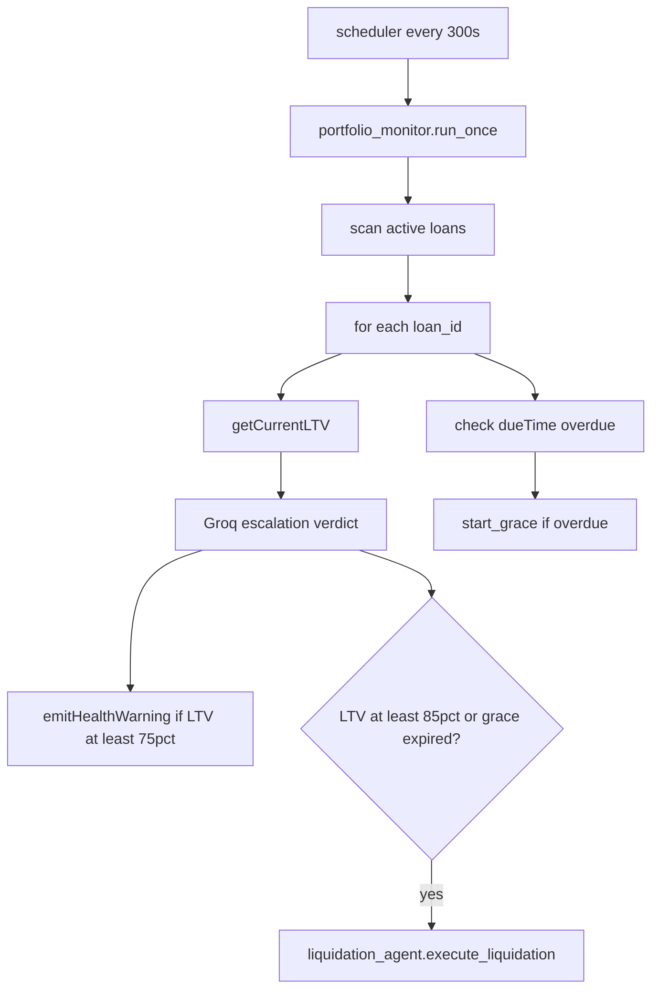

### Liquidation Agent

**File:** `agents/liquidation_agent.py`  
**Trigger:** Portfolio monitor handoff, manual `POST /agents/liquidate`

The liquidation agent is the **enforcement arm** — it is the only agent that seizes collateral, records defaults, blacklists sybil rings, and broadcasts cross-chain default messages.

**`execute_liquidation(loan_id, force_grace=False)` step-by-step:**

1. Read loan from `lending.loans(loanId)` — exit if not active.
2. `getCurrentLTV(loanId)` vs `liquidationThreshold()` (8500 bps).
3. If LTV below threshold and `force_grace=False` → skip (not yet liquidatable).
4. If `force_grace=True` and LTV still low → `ensure_liquidatable()` crashes testnet oracle price.
5. **Sign `lending.liquidate(loanId)`** with `AGENT_PRIVATE_KEY` — collateral seized, loan closed, hub `recordDefault`.
6. **Hub only — graph phase:**
   - `get_transaction_counterparties(borrower)` via Alchemy.
   - `identify_linked_wallets()` + `check_existing_credflow_loans()`.
   - `review_liquidation_blacklist()` — Groq picks blacklist set.
   - `sbt.blacklistLinkedWallets(addrs, defaulter)`.
   - `emitHealthWarning` on linked wallets' open loans.
7. **LZ phase:** `hub.broadcast_default(borrower)` + per-blacklisted-wallet defaults.

On spoke liquidation: steps 5–7 run on spoke lending for step 5, but LZ broadcast always originates from **hub** `CredFlowAgent`.

**Testnet note:** `ensure_liquidatable()` lowers mock Chainlink feed when calendar grace expires but ETH price has not moved — bridge between agent overdue policy and contract LTV-only `liquidate()`.

### Rate Optimizer Agent

**File:** `agents/rate_optimizer.py`  
**Trigger:** Scheduler every **3600 seconds** on hub  
**Wallet:** `AGENT_PRIVATE_KEY`

The rate optimizer is CredFlow's **macro-pricing daemon** — it adjusts the hub lending pool's `baseRate` based on utilization, independent of any individual borrower's score tier rate.

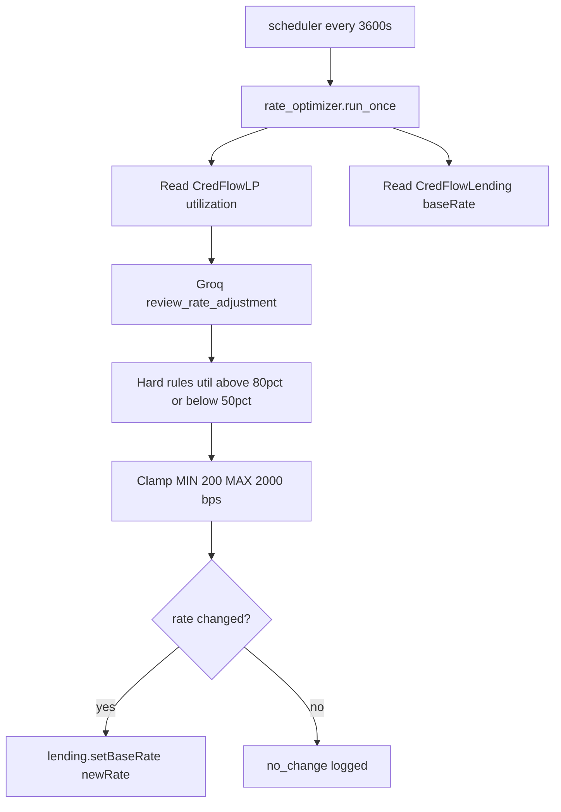

**`run_once()` step-by-step:**

1. **`agent.pool.utilizationRate()`** — current pool utilization in bps (borrowed / deposited).
2. **`agent.pool.totalDeposited()` / `totalBorrowed()`** — raw USDG amounts for Groq context.
3. **`agent.lending.baseRate()`** — current annual base rate in bps.
4. **`review_rate_adjustment(util_bps, current_rate, total_dep, total_borrow)`** — Groq returns `RateVerdict`: `direction` (increase/decrease/hold), `adjust_bps` (-50 to +50), `reasoning`.
5. **Hard rules override Groq:**
   - `util_bps > 8000` (80% utilization) → force at least +10 bps increase (liquidity scarcity).
   - `util_bps < 5000` (50% utilization) → force at least -10 bps decrease (attract borrowers).
6. **Clamp** to `[MIN_BASE_RATE=200, MAX_BASE_RATE=2000]`.
7. If unchanged → log `no_change` and exit.
8. If changed → **`agent.send_tx(lending.setBaseRate(newRate))`** — on-chain update affecting all future hub borrows.

Individual borrowers still get **score-tier rates** from `getRateForScore(score)` at loan creation; `baseRate` is the pool-level floor the optimizer tunes. The portfolio monitor and liquidation agent are unrelated to rate optimization — they watch loan health, not pool economics.

### Agent Scheduler and Triggers

`agents/scheduler.py` runs continuously:

| Interval | Agent | Chains |
|----------|-------|--------|
| 300s | portfolio_monitor | hub, arbitrum, base |
| 3600s | rate_optimizer | hub |
| 3600s | crosschain_sync batch | hub |

**Event-driven triggers** from `frontend/src/lib/agent-client.ts`:

| User action | Agent endpoint |
|-------------|----------------|
| Score complete | `POST /agents/sync-score` |
| SBT mint | `POST /agents/underwrite` → then sync-score |
| Hub borrow | `POST /agents/sync-loan` event=created |
| Hub repay | `POST /agents/sync-loan` event=repaid + re-score + underwrite rescore |

Agent runs are logged to local files and surfaced in the frontend Agents tab (`/api/agents`, `/api/agents/stream`).

### Agent Lifecycle Map

Which agent runs at each system event — contracts only execute what agents (or users) sign:

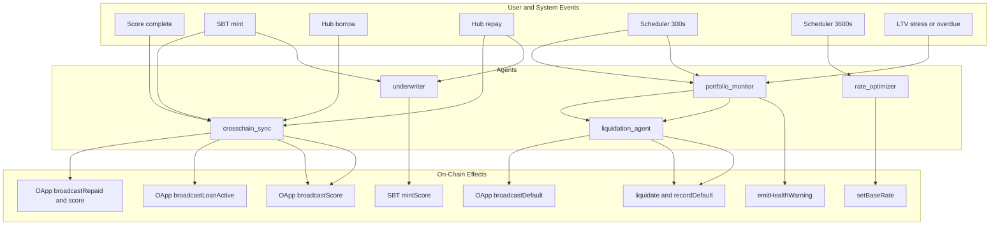

| Event | Agent(s) | Signed transactions | LayerZero messages |
|-------|----------|---------------------|-------------------|
| Score complete | `crosschain_sync` | `broadcastScore` × 2 spokes | `MSG_SCORE_UPDATE` |
| SBT mint | `underwriter`, then `crosschain_sync` | `mintScore` / `mintSBT`, `broadcastScore` | `MSG_SCORE_UPDATE` |
| Hub borrow | `crosschain_sync` | `broadcastScore`, `broadcastLoanActive` × 2 | `MSG_SCORE_UPDATE`, `MSG_LOAN_ACTIVE` |
| Hub repay | scoring API, `underwriter`, `crosschain_sync` | `updateScore`, `broadcastScore`, `broadcastRepaid` | `MSG_SCORE_UPDATE`, `MSG_REPAID` |
| Every 300s | `portfolio_monitor` → maybe `liquidation_agent` | `emitHealthWarning`, `liquidate`, `blacklistLinkedWallets` | `MSG_DEFAULT` on liquidation |
| Every 3600s | `rate_optimizer`, `crosschain_sync` batch | `setBaseRate`, catch-up syncs | varies |
| Spoke borrow | None | User-signed `requestLoan` only | None |

### Groq LLM Decision Layer

**File:** `agents/groq_brain.py`  
**Model:** `GROQ_MODEL` (default `llama-3.3-70b-versatile`) via LangChain structured output

Groq is not a standalone agent — it is the **judgment layer** inside four agents. Every Groq call returns a Pydantic schema; on API failure, conservative rule-based fallbacks apply.

| Function | Called by | Input | Output schema | Fallback behavior |
|----------|-----------|-------|---------------|-------------------|
| `review_underwriting()` | `underwriter_agent` | score, sybil_risk, feature summary | `UnderwritingVerdict` (approve/reject/manual_review) | Reject if score < 500 |
| `review_monitor_escalation()` | `portfolio_monitor` | LTV, max LTV, days to due, overdue | `MonitorVerdict` (escalate, flag_liquidation) | Escalate if LTV ≥ 8000 or overdue |
| `review_liquidation_blacklist()` | `liquidation_agent` | defaulter, linked wallet graph | `LiquidationVerdict` (wallets_to_blacklist) | Blacklist high-confidence links only |
| `review_rate_adjustment()` | `rate_optimizer` | utilization bps, current rate, pool totals | `RateVerdict` (direction, adjust_bps) | Hold rate unchanged |
| `review_sync_priority()` | `crosschain_sync` batch | wallet list with stale scores | `SyncVerdict` (priority_wallets) | Sync all in batch order |

Groq never signs transactions. It only influences whether an agent proceeds, whom to blacklist, or how many bps to adjust. Hard rules in each agent can override Groq (e.g. utilization > 80% always increases rate regardless of LLM suggestion).

---

## Credit Scoring System

This is CredFlow's product core. We do not guess creditworthiness from wallet age alone — we rebuild a **multi-protocol financial picture**, optionally anchor it with **bank-verified capacity**, and produce a score the rest of the app (and all five agents) trust. Every borrow quote, approval gate, SBT field, and cross-chain sync traces back to this pipeline.

The scoring API ingests multi-chain wallet and protocol history, runs ML inference, optionally verifies bank balance via Reclaim zkTLS, commits the result on-chain as an SBT (via the underwriter agent), and mirrors the score to every lending market via cross-chain sync.

### End-to-End Pipeline

Entry point: `POST /score` in `ml/scoring_api.py` → `_score_sync()`.

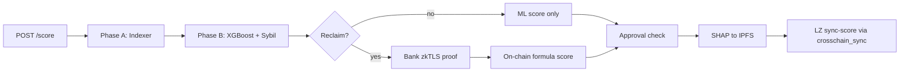

**Phase A (parallel):**

- `indexer/collect_sources.py` → `collect_all_sources(wallet)`
- Borrow features: Aave V3 (Arbitrum + Base), Morpho Blue (Base), CredFlow hub + spoke loans
- Wallet features: Alchemy RPC transfer graph, tx counts, activity windows
- Robinhood hub pipeline: CredFlow lending events on testnet

**Phase B (parallel):**

- `ml/train_model.py` → `score_wallet()` — XGBoost classifier → default probability
- `ml/sybil_detector.py` → `run_sybil_check()` — R-GCN graph inference + heuristics

**Optional Reclaim:**

- User opens Reclaim portal URL, logs into bank
- Callback hits `POST /receive-proof`
- `ml/score_engine.py` → `compute_on_chain_cred_score(defaultProbBps, balanceUsdCents)`

**Approval rules:**

```
approved = on_chain_cred_score >= 500 AND sybil_risk != "high"
```

**Outputs:** `cred_score`, `ml_cred_score`, `on_chain_cred_score`, `borrow_sub_score`, `wallet_sub_score`, SHAP CID, model breakdown, sybil verdict.

Frontend proxy: `frontend/src/app/api/score/route.ts` → forwards to ML API, then `triggerSyncScore()` invokes crosschain_sync.

### Alchemy Wallet Data

**File:** `indexer/alchemy_pipeline.py`

Alchemy provides the **wallet behavior layer** — raw chain data that cannot be inferred from a single protocol:

| Data point | Used for |
|------------|----------|
| `tx_count` | Lifetime activity volume |
| `wallet_first_seen` / `wallet_last_active` | Age and recency features |
| `recent_transactions` | Sybil graph edges, burst detection |
| `eth_balance_wei` | Current ETH holdings |
| `unique_contracts_interacted` | DeFi breadth vs single-protocol gaming |

Set `ALCHEMY_API_KEY` in `.env`. Use `USE_MOCK_DATA=1` for offline development.

The Alchemy transfer graph also feeds **R-GCN Sybil detection** — nodes are wallets, edges are transfers, and on-chain blacklist addresses from hub/spoke OApps are overlaid as risk seeds.

### Multi-Protocol Indexer

**Orchestrator:** `indexer/collect_sources.py`  
**Aggregator:** `indexer/aggregate.py`  
**Feature builder:** `ml/feature_engineering.py` → `build_feature_vector()`

| Pipeline | File | Chains | Events captured |
|----------|------|--------|-----------------|
| Robinhood hub | `indexer/robinhood_pipeline.py` | 46630 | CredFlow lending borrow/repay/liquidate |
| Aave V3 | `indexer/spoke_pipeline.py` | Arbitrum + Base Sepolia | Supply, withdraw, borrow, repay, liquidate |
| Morpho Blue | `indexer/morpho_pipeline.py` | Base Sepolia | Supply, withdraw, borrow, repay |
| CredFlow spokes | `indexer/spoke_credflow_pipeline.py` | Arbitrum + Base | Spoke lending loan counter scan |
| Scoring metrics | `indexer/scoring_metrics.py` | All | Repay ratios, durations, red-flag derivation |

Cross-protocol aggregates (`total_borrow_count`, `repay_ratio`, `borrow_diversity`, etc.) are computed in `aggregate.py` and merged into the 37-feature vector.

**Prep Wallet tab** (`frontend/src/lib/prep-wallet-server.ts`) runs Hardhat scripts to seed on-chain history (Aave, Morpho, transfers) so the indexer has real features to score against.

### Reclaim Protocol (zkTLS Bank Balance)

**Files:** `ml/reclaim_service.py`, `ml/score_engine.py`, `scripts/reclaim_helper.js`, `contracts/CredScoreEngine.sol`

Reclaim adds an **off-chain capacity signal** without CredFlow ever seeing bank credentials. The user proves account balance through Reclaim's zkTLS portal; CredFlow receives only a verified balance figure and a cryptographic proof hash.

#### What zkTLS Does Here

Traditional bank verification requires sharing statements or API keys. Reclaim uses **TLS session proofs**: the user's browser establishes a TLS connection to their bank, and Reclaim generates a proof that specific fields (e.g. available balance) were returned by that server. CredFlow receives:

- Parsed balance (INR → USD via live FX from `exchangerate.host`)
- `balance_usd_cents` stored in the session
- `proof_hash` — SHA-256 of the proof payload, committed on-chain at SBT mint

No username, password, or full statement is persisted in CredFlow.

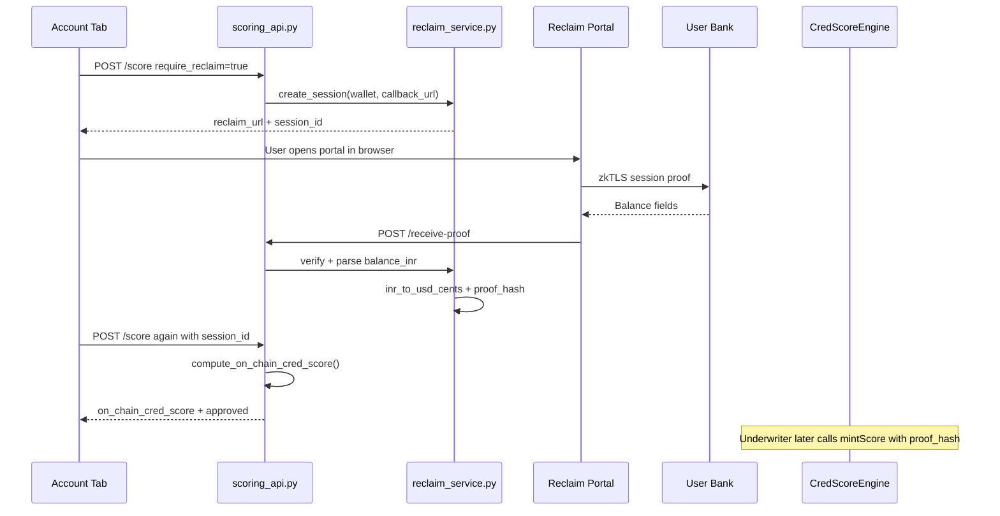

#### Session Lifecycle

1. **Create** — `create_session()` invokes `scripts/reclaim_helper.js` with `RECLAIM_APP_ID`, `RECLAIM_APP_SECRET`, `RECLAIM_PROVIDER_ID`. Returns `requestUrl` for the user.
2. **Await** — First `POST /score` returns `status: awaiting_reclaim` with portal URL. User completes bank login.
3. **Callback** — Reclaim POSTs proof to `POST /receive-proof` (ngrok tunnel auto-configured by `npm run ml:serve`).
4. **Resume** — Second `POST /score` with `reclaim_session_id` reads verified session, computes final score.
5. **Reuse** — `reuse_verified_reclaim: true` skips re-login if a verified session exists for the wallet.

Sessions live in **in-memory** `_sessions` dict (15-minute TTL by default). Restarting the ML API clears pending sessions.

#### Balance → Score Formula

`ml/score_engine.py` mirrors `CredScoreEngine.computeCredScore()` on-chain:

| Bank balance (USD) | Capacity factor (bps) | Effect |
|------------------|----------------------|--------|
| ≥ $5,000 | 9200 | Strongest lift on ML default prob |
| ≥ $1,000 | 9600 | Moderate lift |
| ≥ $100 | 9800 | Slight lift |
| < $100 | 10000 | No adjustment (ML score only) |

```
adjusted_default_bps = default_prob_bps * capacity_factor / 10000
on_chain_cred_score  = 300 + (10000 - adjusted_default_bps) * 550 / 10000
```

A borrower with mediocre on-chain history but $3,000 in verified bank balance gets a meaningfully higher `on_chain_cred_score` than ML alone — reflecting real-world repayment capacity.

#### On-Chain Commitment

When Reclaim is enabled, the **underwriter agent** calls:

```solidity
CredScoreEngine.mintScore(defaultProbBps, balanceUsdCents, reclaimProofHash, ...)
```

The proof hash is stored as an attestation on the SBT. Anyone can verify the score was computed with a specific Reclaim proof — auditable off-chain capacity without exposing bank data.

**Environment:** `RECLAIM_ENABLED=1`, `RECLAIM_APP_ID`, `RECLAIM_APP_SECRET`, `RECLAIM_PROVIDER_ID`, `RECLAIM_CALLBACK_URL`. Use `USE_MOCK_RECLAIM=1` for offline dev without portal login.

#### Error and Edge Cases

| Situation | System behavior |
|-----------|-----------------|
| User abandons portal | Session stays `pending`; expires after `RECLAIM_SESSION_TTL_SEC` (900s default) |
| ML API restarted mid-flow | In-memory sessions lost; user must restart Reclaim login |
| `reuse_verified_reclaim` with no session | Error: "No verified Reclaim session — complete bank login first" |
| Stored profile balance reuse | `stored_balance_usd_cents` from prior verified run can skip portal if session expired |
| FX API down | Falls back to `INR_PER_USD` env var (default 86) |
| `USE_MOCK_RECLAIM=1` | `create_session` returns `mock://reclaim/{id}` — no Node helper call |
| Proof callback failure | `POST /receive-proof` rejects; session stays pending |

#### INR → USD Conversion

Reclaim providers often return INR balances. `parse_balance_inr()` extracts numeric value from `balance`, `accountBalance`, or `availableBalance` fields. `fetch_inr_per_usd()` caches live rate for 1 hour from `exchangerate.host`. Final `balance_usd_cents` feeds both the API preview (`on_chain_cred_score`) and the underwriter's `mintScore()` call.

#### Why Reclaim Matters for Undercollateralized Lending

On-chain history alone cannot see savings, salary deposits, or existing credit lines. A wallet with thin DeFi activity but $4,000 in verified bank balance is a fundamentally different credit risk than a wallet with the same on-chain footprint and $50. Reclaim closes that gap **without custodial bank access** — only a zkTLS proof and a balance number enter the pipeline.

### XGBoost Model

**Training:** `npm run ml:train` → `scripts/train_ml.py` → `ml/generate_synthetic_data.py` + `ml/train_model.py`  
**Artifacts:** `ml/credflow_model.pkl`, `ml/credflow_explainer.pkl`

The model is a **gradient-boosted classifier** (XGBoost) trained on synthetic data shaped by the 37 features. Inference:

```
default_prob = model.predict_proba(features)[1]
cred_score   = 300 + (1 - default_prob) * 550    # range 300–850
```

**SHAP explainability:** `train_model.py` computes per-feature SHAP values → `ml/ipfs_pinata.py` uploads JSON to Pinata IPFS → CID stored on SBT at mint time.

**Sub-scores:** `ml/sub_scores.py` computes `borrow_sub_score` (repayment history weight) and `wallet_sub_score` (activity/age weight) for display and on-chain storage.

XGBoost over hand-tuned rules matters because repayment behavior is **non-linear**: one liquidation matters more than five small repays; multi-protocol history compounds; red-flag booleans interact. A calibrated classifier on 37 engineered features is the industry-standard path toward portable, auditable credit scores — the same direction traditional credit bureaus took, but with on-chain verifiability and cross-chain portability via SBT + LayerZero.

### All 37 Model Features

Source: `ml/constants.py` → `FEATURE_COLUMNS`. Built by `ml/feature_engineering.py`.

#### Wallet-Level Features (7)

| # | Feature | Source | Meaning | Scoring impact |
|---|---------|--------|---------|----------------|
| 1 | `wallet_age_days` | Alchemy | Days since first transaction | Older wallets score higher; sybil farms use fresh wallets |
| 2 | `tx_count` | Alchemy | Total lifetime transactions | More activity → more signal; very low counts are suspicious |
| 3 | `unique_contracts_interacted` | Alchemy | Distinct contract addresses used | Breadth indicates real DeFi user vs single-protocol bot |
| 4 | `active_months_last_6` | Alchemy | Months with ≥1 tx in last 6 months | Consistent usage beats one-time bursts |
| 5 | `days_since_last_active` | Alchemy | Days since most recent transaction | Recent activity preferred; dormant wallets penalized |
| 6 | `longest_inactive_gap_days` | Alchemy | Longest gap between consecutive txs | Large gaps suggest abandoned or farmed wallets |
| 7 | `eth_balance` | Alchemy | Current ETH balance (ETH units) | Small positive signal for non-zero balance |

#### CredFlow Hub Features (3)

| # | Feature | Source | Meaning | Scoring impact |
|---|---------|--------|---------|----------------|
| 8 | `credflow_borrow_count` | Robinhood pipeline | Hub CredFlowLending borrow events | Repeat hub borrowing with repays is strong signal |
| 9 | `credflow_repay_count` | Robinhood pipeline | Hub CredFlowLending repay events | Direct repayment track record on CredFlow |
| 10 | `credflow_liquidation_count` | Robinhood pipeline | Hub liquidation events | Any liquidation is a major negative |

#### Aave V3 Spoke Features (5)

| # | Feature | Source | Meaning | Scoring impact |
|---|---------|--------|---------|----------------|
| 11 | `aave_supply_count` | Spoke pipeline | Aave supply transactions (Arb + Base) | Collateral provision shows skin in the game |
| 12 | `aave_withdraw_count` | Spoke pipeline | Aave withdraw transactions | Withdrawals before borrow are risky pattern |
| 13 | `aave_borrow_count` | Spoke pipeline | Aave borrow transactions | Core borrow history signal |
| 14 | `aave_repay_count` | Spoke pipeline | Aave repay transactions | Highest-weight positive signal |
| 15 | `aave_liquidation_count` | Spoke pipeline | Aave liquidation events | Hard negative; sets `has_been_liquidated` |

#### Morpho Blue Features (4)

| # | Feature | Source | Meaning | Scoring impact |
|---|---------|--------|---------|----------------|
| 16 | `morpho_supply_count` | Morpho pipeline | Morpho supply on Base Sepolia | Additional protocol breadth |
| 17 | `morpho_withdraw_count` | Morpho pipeline | Morpho withdraw events | Collateral drain pattern input |
| 18 | `morpho_borrow_count` | Morpho pipeline | Morpho borrow events | Multi-protocol borrow history |
| 19 | `morpho_repay_count` | Morpho pipeline | Morpho repay events | Cross-protocol repayment discipline |

#### Cross-Protocol Derived Features (12)

| # | Feature | Source | Meaning | Scoring impact |
|---|---------|--------|---------|----------------|
| 20 | `total_borrow_count` | Aggregate | Sum of CredFlow + Aave + Morpho borrows | Volume of borrow experience |
| 21 | `total_repay_count` | Aggregate | Sum of all protocol repays | Total repayment track record |
| 22 | `repay_ratio` | Aggregate | `total_repay / total_borrow` | **Primary predictor** — highest model weight |
| 23 | `avg_blocks_to_repay` | Scoring metrics | Mean blocks between borrow and following repay | Faster repays score better |
| 24 | `avg_loan_duration_days` | Scoring metrics | Mean loan open duration | Shorter disciplined durations preferred |
| 25 | `collateral_withdraw_before_borrow_count` | Scoring metrics | Withdrawals shortly before borrows | Risky leverage extraction pattern |
| 26 | `net_collateral_position` | Scoring metrics | Total supplied minus withdrawn | Positive net position is safer |
| 27 | `borrow_diversity` | Scoring metrics | Unique assets borrowed | Diversified borrowing vs single-asset farming |
| 28 | `collateral_diversity` | Scoring metrics | Unique assets supplied | Collateral spread indicator |
| 29 | `partial_repay_count` | Scoring metrics | Partial (non-full) repay events | Some partial repays OK; zero full repays bad |
| 30 | `partial_repay_ratio` | Scoring metrics | Partial repays / total repays | Balance of partial vs full settlement |
| 31 | `multi_protocol_borrow_flag` | Aggregate | 1 if borrowed on 2+ protocols | Indicates real DeFi user |

#### Red-Flag Boolean Features (6)

| # | Feature | Source | Meaning | Scoring impact |
|---|---------|--------|---------|----------------|
| 32 | `has_been_liquidated` | Aggregate | 1 if any protocol liquidation | Instant hard penalty in model + sub-scores |
| 33 | `wallet_age_flag` | Feature engineering | 1 if `wallet_age_days < 7` | Sybil / fresh-wallet indicator |
| 34 | `zero_repays_multiple_borrows_flag` | Feature engineering | 1 if ≥2 borrows and 0 repays | Never paid back — severe red flag |
| 35 | `burst_activity_flag` | Alchemy heuristics | 1 if all activity in short burst | Bot-like fabricated history |
| 36 | `aave_only_wallet_flag` | Wallet heuristics | 1 if only Aave interactions | Thin profile — suspicious |
| 37 | `borrow_then_transfer_out_flag` | Scoring metrics | 1 if borrow followed by large outbound transfer | Extractive / hit-and-run pattern |

### R-GCN Sybil Detection

**Files:** `ml/sybil_detector.py`, `ml/sybil_model.pt`, `ml/on_chain_blacklist.py`, `scripts/train_sybil.py`

Undercollateralized lending fails if attackers spin up fresh wallets with fabricated Aave history. CredFlow's sybil layer treats the wallet's **transfer graph** as a first-class signal — the same problem identity graphs solve in traditional credit, applied to on-chain topology.

#### Graph Construction

`build_transaction_graph()` ingests Alchemy `recent_transactions` and builds a directed graph:

| Graph element | Source | Purpose |
|---------------|--------|---------|
| Nodes | Wallet + all `from`/`to` addresses in transfers | Entities in the interaction network |
| Edges | Each unique transfer `from → to` | Funding and payout paths |
| Node features (4-dim) | Per-node computation | `is_target`, `is_defaulter`, `tx_degree/20`, `unique_counterparties/30` |
| Risk seed addresses | Hub SBT blacklist + spoke OApp `defaultBlacklist` | Known bad actors on the graph |

**Early hard reject:** If the target wallet has any direct transfer link to a known defaulter/blacklisted address (`defaulter_links > 0`), sybil risk is immediately **`high`** — no model inference needed.

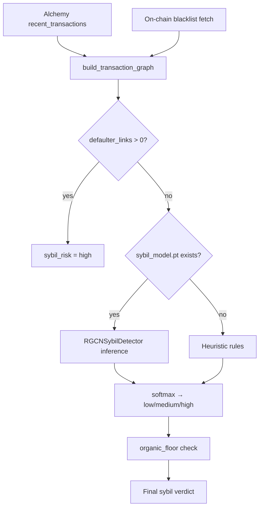

#### R-GCN Model Architecture

`RGCNSybilDetector` (`ml/sybil_detector.py`) uses **Relational Graph Convolutional Networks** (PyTorch Geometric):

```
Input:  node features (4) + edge_index + edge_type
  → RGCNConv(4 → 16) + ReLU + Dropout(0.2)
  → RGCNConv(16 → 16) + ReLU
  → Linear(16 → 3) on target wallet node
  → softmax → class probabilities [low, medium, high]
```

Training: `npm run ml:sybil-train` → `scripts/train_sybil.py`. Artifact: `ml/sybil_model.pt`.

R-GCN is chosen over flat XGBoost here because sybil risk is **inherently relational** — a wallet's risk depends on who funded it and who it paid, not just its own tx count. Convolution over neighbors propagates risk from blacklisted/defaulter nodes through the graph.

#### Heuristic Fallback

When `sybil_model.pt` is missing, `_heuristic_sybil_risk()` applies rules:

| Signal | Points | Meaning |
|--------|--------|---------|
| `defaulter_links > 0` | +3 | Direct link to known bad actor |
| `spray_score >= 15` | +2 | Fan-out to many unique addresses, few repeats (airdrop farm pattern) |
| `unique_counterparties >= 25` and `hub_score <= 3` | +2 | Spray without hub concentration |
| `unique_counterparties >= 40` | +1 | Very wide counterparty set |

Score ≥ 3 → `high`; ≥ 2 → `medium`; else `low`.

**Organic floor:** Wallets with ≤ 5 unique counterparties, ≤ 200 lifetime txs, and no defaulter links are forced to `low` even if R-GCN outputs medium/high — prevents false positives on genuinely new but honest users.

#### Integration with Scoring Pipeline

`run_sybil_check()` runs in **Phase B** parallel with XGBoost in `_score_sync()`. Result fields:

- `sybil_risk`: `low` | `medium` | `high`
- `sybil_score`: numeric severity
- `method`: `rgcn`, `heuristic`, `defaulter_link`, or `rgcn+organic_floor`
- `defaulter_links`, `unique_counterparties`

**Hard gate:** `approved = false` when `sybil_risk == "high"` regardless of XGBoost score. Medium/low sybil with score ≥ 500 can still be approved.

The same graph infrastructure serves two phases:

| Phase | Module | Purpose |
|-------|--------|---------|
| **Origination** | `ml/sybil_detector.py` → `run_sybil_check()` | R-GCN classifies target wallet sybil risk before approval |
| **Default** | `ml/graph_analysis.py` → `identify_linked_wallets()` | BFS/transfer analysis finds sybil ring members to blacklist |

At origination, the graph asks: "Is **this** wallet likely a sybil?" At default, the graph asks: "Who is **connected** to this defaulter and should be blacklisted?"

#### Training the Sybil Model

`npm run ml:sybil-train` → `scripts/train_sybil.py` trains `RGCNSybilDetector` on synthetic graph data with labeled sybil/organic wallets. The trained weights serialize to `ml/sybil_model.pt`. At inference, `torch.load(..., weights_only=True)` loads on CPU — no GPU required for scoring API.

#### Spray vs Hub Patterns

Two sybil farm shapes the heuristics and model learn to detect:

- **Spray pattern** — wallet sends small amounts to many unique addresses once each (`spray_score` high, `hub_score` low). Typical airdrop-farming or wash-wallet seeding.
- **Hub pattern** — many wallets funnel funds to/from one central address (`hub_score` high). Typical coordinator wallet in a sybil ring.

`defaulter_links` connects the graph to **live protocol state** — if your wallet received funds from an address already blacklisted on hub SBT or spoke OApp, you inherit that risk immediately.

### Underwriter and SBT Mint

After scoring completes in the UI (`YourAccountTab` → Build Score → Score Complete), the **underwriter agent** commits credit on-chain. This is separate from the ML scoring API — scoring computes; underwriter decides and writes.

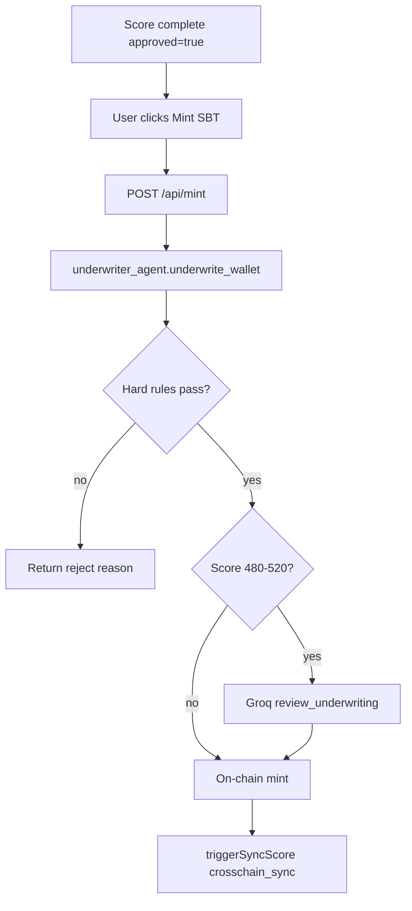

**What gets written to `CredScoreSBT`:**

| Field | Source |
|-------|--------|
| `score` | `on_chain_cred_score` (Reclaim-adjusted) or `ml_cred_score` |
| `borrowSubScore` | `ml/sub_scores.py` repayment weight |
| `walletSubScore` | `ml/sub_scores.py` activity weight |
| `shapCid` | Pinata IPFS CID of SHAP explanation JSON |
| `loanStatus` | 0 = none at mint |
| `loanActive` | false at mint |
| `defaultCount` | 0 at mint |

**Agent actions the underwriter performs:**

1. HTTP call to scoring API (unless `score_snapshot` provided by post-repay pipeline).
2. Groq borderline review if applicable.
3. Web3 transaction: `CredScoreEngine.mintScore(...)` or `SBT.mintSBT(...)`.
4. Does **not** call LayerZero directly — caller (`/api/mint` or post-repay pipeline) invokes `triggerSyncScore()` afterward.

The SBT is **non-transferable** (soulbound). It is the borrower's portable credit commitment on the hub. Spokes never mint SBTs — they read mirrored state from `CredFlowOApp` via LayerZero (see [LayerZero Cross-Chain Messaging](#layerzero-cross-chain-messaging)).

### Interest Rate and Tier Summary

`CredFlowLending.getRateForScore(score)` returns annual rate in bps. Higher scores receive lower borrow rates. The rate optimizer adjusts `baseRate` on the hub lending contract based on `CredFlowLP` utilization, within bounds enforced in `agents/rate_optimizer.py`.

At borrow time, the loan stores `interestRate` and `maxLTV` from the score tier. Interest accrues linearly:

```
interest = borrowedAmount * interestRate * elapsedSeconds / (365 days * 10000)
```

| Component | Range / value | Notes |
|-----------|---------------|-------|
| `cred_score` / SBT score | 300–850 | FICO-like scale from ML default probability |
| Approval threshold | ≥ 500 | Hard rule in scoring API + underwriter |
| Borderline Groq review | 480–520 | Underwriter LLM decision band |
| Sybil hard reject | `high` | Overrides score |
| Default LZ spoke score | 310 | After `MSG_DEFAULT` |
| Max LTV tiers | 40%–85% | Score 500–750 |
| Health warning LTV | 75% | Agent `emitHealthWarning` |
| Liquidation LTV | 85% | Contract `liquidationThreshold` |
| Liquidation penalty | 5% | On seized collateral |
| Grace period | 48 hours | Agent in-memory; calendar overdue |

---

## Borrowing Logic

Your CredScore only matters if it changes how you borrow. The **Loans** tab turns score into concrete terms — max LTV, interest rate, and required collateral — then submits on-chain `requestLoan` transactions. Display score is resolved from Supabase (same source as the dashboard); on-chain eligibility uses the live credit registry on each chain.

Borrowing is initiated from the **Loans** tab → `PurchaseLoanPanel` → `POST /api/loans/borrow`. The server wallet (`FRONTEND_PRIVATE_KEY`) signs all on-chain transactions via `frontend/src/lib/loan-server.ts`.

Before borrow, the API reads score, blacklist status, and active loan state on Robinhood testnet, Arbitrum Sepolia, and Base Sepolia. A Robinhood loan locks borrowing on the other chains via LayerZero until repaid — the cross-chain sync agent enforces one loan per identity.

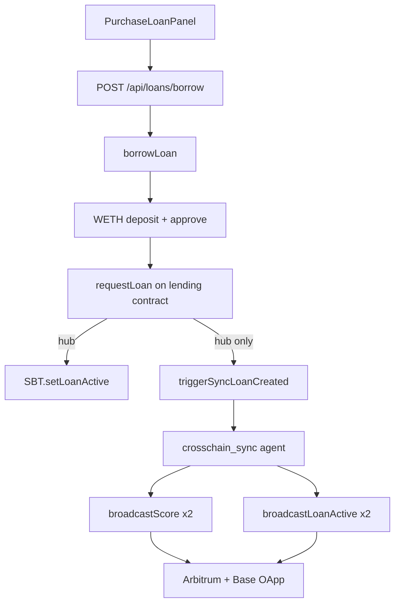

### Collateral and LTV Tiers

Collateral is computed in `computeRequiredCollateral()` (`loan-server.ts`) and `loan-collateral.ts`:

```
collateralValueUSD = borrowAmount * 10000 / maxLTV
collateralWei      = collateralValueUSD / ethUsdPrice
```

Oracle: hub uses `ChainlinkOracle` + `MockChainlinkFeed`; spokes use `ChainlinkMirrorFeed` (mainnet ETH/USD mirrored).

**Score → max LTV** (both `CredFlowLending` and `CredFlowSpokeLending`):

| Score tier | Max LTV |
|------------|---------|
| 500 | 40% |
| 580 | 50% |
| 620 | 60% |
| 680 | 65% |
| 720 | 75% |
| 750 | 85% |

Below 500: no LTV tier — borrow rejected at contract level.

### Hub vs Spoke Borrow

**Shared steps** (`borrowLoan`):

1. `WETH.deposit()` — wrap ETH collateral.
2. `WETH.approve(lending, collateral)`.
3. `simulateContract` + `requestLoan(borrowAmount, weth, collateral, durationDays)`.

**Hub — `CredFlowLending.requestLoan()`:**

- Requires `sbtContract.hasProfile(msg.sender)`.
- Reads score from SBT; checks `!profile.loanActive`, `defaultCount == 0`.
- Pulls WETH collateral; creates loan; sets `activeLoanId`.
- `sbtContract.setLoanActive(msg.sender)`.
- `liquidityPool.recordBorrow(borrowAmount)`.
- Transfers **USDG** to borrower.

**Spoke — `CredFlowSpokeLending.requestLoan()`:**

- Reads `creditRegistry.getScore()` from local `CredFlowOApp`.
- Checks `!creditRegistry.isLoanActive()` (LZ mirror), `!isBlacklisted()`.
- Same collateral/LTV math; borrows **USDC**.
- Does **not** touch hub SBT.

### Post-Borrow LayerZero Sync

**Hub borrow only** — spoke borrows do not invoke any agent. Full LayerZero architecture, message types, and stale-lock behavior: [LayerZero Cross-Chain Messaging](#layerzero-cross-chain-messaging).

After `requestLoan()` succeeds on the hub, `frontend/src/lib/agent-client.ts` calls `triggerSyncLoanCreated()`, which hits `POST /agents/sync-loan` with `event: created`. The **crosschain_sync agent** (`agents/sync_service.py` → `sync_wallet_loan_active()`) then:

1. **Verifies hub loan exists** — reads `lending.activeLoanId(wallet)`. If zero (edge case), broadcasts repaid-clear instead of loan-active.
2. **Reads current SBT score** — `sbt.getProfile(wallet).score`.
3. **Signs two LZ txs per spoke** using `AGENT_PRIVATE_KEY`:
   - `CredFlowOApp.broadcastScore([40231], wallet, score, lzOptions)` — Arbitrum
   - `CredFlowOApp.broadcastScore([40245], wallet, score, lzOptions)` — Base
   - `CredFlowOApp.broadcastLoanActive([40231], wallet, lzOptions)` — Arbitrum
   - `CredFlowOApp.broadcastLoanActive([40245], wallet, lzOptions)` — Base
4. **Pays native ETH** for LayerZero messaging fees (`lz_fee_for_broadcast` per destination).
5. **Logs run** to `AgentRunLogger` with hub tx hashes per EID.

On each spoke, `_lzReceive` sets `loanActiveMirror[borrower] = true`. `CredFlowSpokeLending.requestLoan()` then rejects that wallet with `"Cross-chain loan active"` until hub repay delivers `MSG_REPAID`.

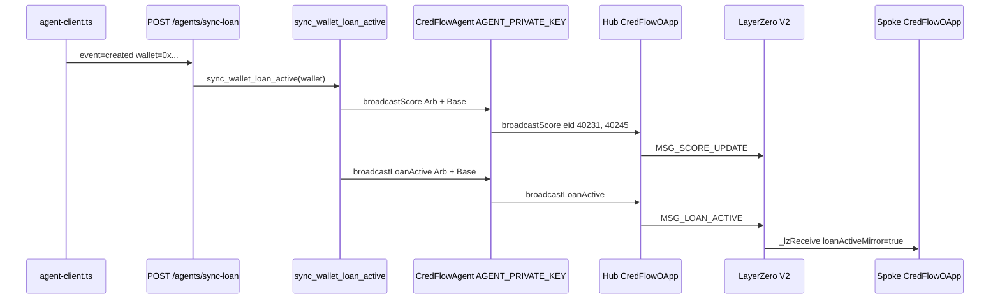

The **underwriter does not run on borrow** — only `crosschain_sync`.

---

## Repayment Logic

Repaying is where credit **compounds**. A successful repay triggers rescoring, SBT updates, and cross-chain unlock — the underwriter and cross-chain sync agents run automatically so improved repayment behavior updates every market. Good repayment history is exactly the signal the 37-feature model is built to reward.

Repayment is initiated from `RepayLoanPanel` → `POST /api/loans/repay` → `repayLoan()` in `loan-server.ts`, followed by `runPostRepayPipeline()` in `agent-client.ts`.

### On-Chain Repay

`CredFlowLending.repayLoan(loanId)` / `CredFlowSpokeLending.repayLoan(loanId)`:

1. Verify `loan.borrower == msg.sender` and `loan.active`.
2. Compute interest via `calculateInterest(loan)`.
3. `totalRepay = borrowedAmount + interest`.
4. Pull borrow token (USDG/USDC) from borrower.
5. Return WETH collateral to borrower.
6. Set `loan.active = false`, `activeLoanId[borrower] = 0`.
7. **Hub only:** `sbtContract.setLoanRepaid(msg.sender)`.
8. `liquidityPool.recordRepayment(borrowedAmount)`.
9. Emit `LoanRepaid`.

The borrower must hold sufficient borrow tokens + approve the lending contract. Interest accrues linearly from `startTime` at the score-tier rate set at borrow time.

### Post-Repay Pipeline

`runPostRepayPipeline()` in `agent-client.ts` orchestrates three agents after on-chain repay:

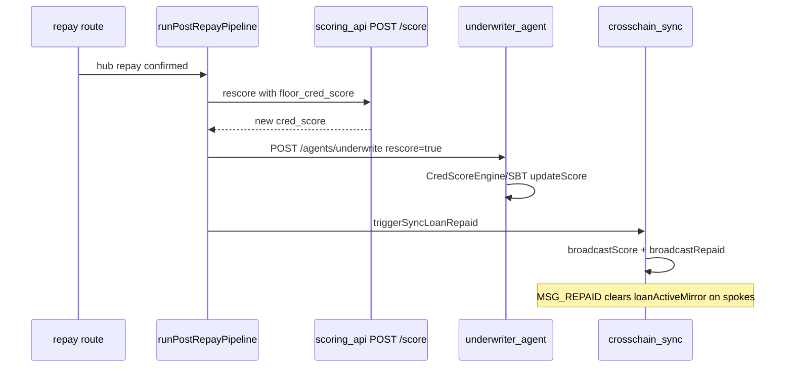

**Step 1 — Re-score (`scoring_api.py`):** Full indexer + XGBoost + Sybil run again. `floor_cred_score` prevents the new score from dropping far below the pre-repay score — repaying should not punish the borrower.

**Step 2 — Underwriter rescore (`underwriter_agent.py`):** With `rescore=true`, skips "SBT already exists" guard. Reads fresh score snapshot, applies hard rules again, writes updated score to SBT via `CredScoreEngine.mintScore()` or `SBT.updateScore()`. Does **not** re-mint a new token — updates existing profile.

**Step 3 — Crosschain sync (`sync_wallet_repaid_with_score()`):** Agent wallet signs:
- `broadcastScore` with **new** score to Arbitrum + Base
- `broadcastRepaid` to Arbitrum + Base → `loanActiveMirror[wallet] = false`

**Step 4 — Fallback (`triggerClearSpokeLoanActive`):** If the combined repaid+score sync fails (e.g. hub tx reverted), sends repaid-only broadcast to clear stale spoke locks without waiting for manual intervention.

Repayment is a **positive credit event** — improved `repay_ratio` and completed loan should lift the score that gets committed on-chain and mirrored cross-chain.

### LayerZero Unlock

Hub repay triggers **`sync_wallet_repaid_with_score()`** in `agents/sync_service.py`. See [LayerZero Cross-Chain Messaging](#layerzero-cross-chain-messaging) for the full repaid/default message spec and `lz_clear_pending` recovery.

1. Reads updated score from SBT (or uses score passed from post-repay pipeline).
2. Signs `broadcastScore([40231, 40245], wallet, newScore, lzOptions)` — two hub txs.
3. Signs `broadcastRepaid([40231, 40245], wallet, lzOptions)` — two more hub txs.
4. Each tx pays LZ native fee; logs EID + tx hash to `AgentRunLogger`.

On spokes, `_lzReceive` for `MSG_REPAID`:

```solidity
loanActiveMirror[wallet] = false;
```

Spoke borrowing is unblocked. If LZ delivery lags, `triggerClearSpokeLoanActive()` sends repaid-only broadcast as fallback — agent signs `broadcastRepaid` without score refresh to clear stale `loanActiveMirror`.

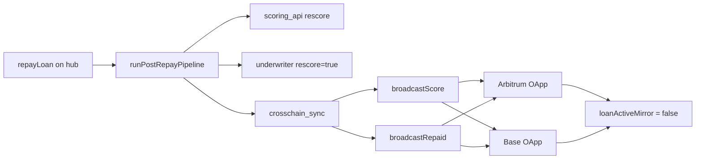

---

## Scenario: Price Goes Down

CredFlow does not set and forget loans after disbursement. The **portfolio monitor agent** polls every active loan on every chain every five minutes. If collateral value drops and LTV rises, the same agent stack that underwrote you can warn on-chain, liquidate, blacklist linked sybil wallets, and sync defaults globally.

When ETH price falls, collateral value drops and **LTV rises** — even if the borrower is not overdue. Contracts react to LTV; agents watch continuously and act when thresholds are breached.

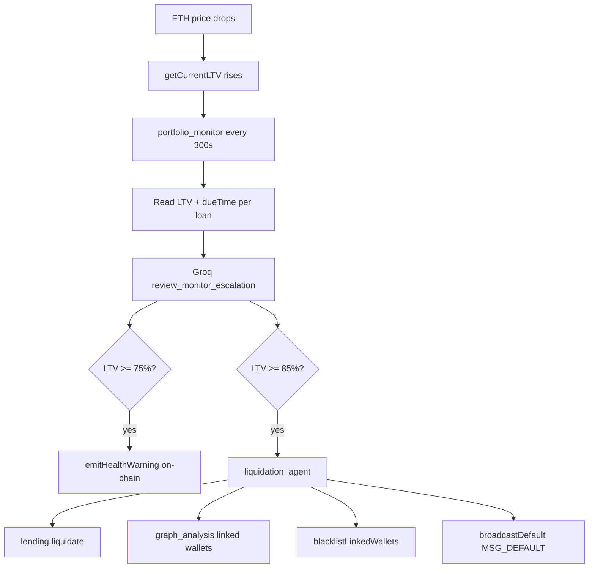

### LTV Monitoring

Contracts compute LTV on every `getCurrentLTV(loanId)` call:

```
LTV_bps = (borrowedAmount + interest) * 10000 / collateralValueUSD
```

`collateralValueUSD` comes from the oracle at call time — a price drop immediately increases LTV. No agent involvement is required for this math; agents **poll** it.

### Portfolio Monitor Agent in Action

**File:** `agents/portfolio_monitor.py`  
**Scheduler:** `agents/scheduler.py` every **300 seconds** on hub, Arbitrum, and Base

Each cycle, `_monitor_loan()` runs per active loan:

1. **`_scan_active_loans()`** — iterates `loanCounter` or scans `LoanCreated` events for `loan.active == true`.
2. **`lending.loans(loanId).call()`** — reads borrower, `dueTime`, `maxLTV`.
3. **`lending.getCurrentLTV(loanId).call()`** — live LTV from current oracle price.
4. **`review_monitor_escalation()`** (Groq) — inputs: `loan_id`, `borrower`, `ltv_bps`, `max_ltv_bps`, `days_to_due`, `overdue`. Returns `escalate`, `severity`, `flag_liquidation`. Fallback when Groq unavailable: escalate if `ltv >= 8000` or overdue.
5. **Health warning path** — if `ltv >= 7500` and `should_emit_warning()` (1-hour dedupe per loan/LTV):
   - Agent signs `lending.emitHealthWarning(loanId)` — on-chain event only, no fund movement.
   - `record_warning(loan_id, ltv)` in `agents/state.py`.
6. **Liquidation handoff** — if `ltv >= 8500` and Groq `flag_liquidation`, OR `grace_expired(loan_id)`:
   - Instantiates `LiquidationAgent` with hub agent + spoke agent (if monitoring spoke chain).
   - Calls `execute_liquidation(loan_id)`.
   - `clear_grace(loan_id)` on success.

The monitor uses `AGENT_PRIVATE_KEY` for `emitHealthWarning` and delegates liquidation to the liquidation agent on the same chain where the loan lives.

### Health Warnings

| Threshold | BPS | Agent action | Contract effect |
|-----------|-----|--------------|-----------------|
| Health warning | 7500 (75%) | `portfolio_monitor` → `emitHealthWarning(loanId)` | `HealthWarning` event emitted |
| Liquidation | 8500 (85%) | `portfolio_monitor` → `liquidation_agent.execute_liquidation()` | Collateral seized, loan closed |

Health warnings are **audit events** — the borrower's position is flagged on-chain but no collateral is moved. The Agents tab logs each warning tx hash.

### Liquidation Agent and LayerZero Default

When LTV ≥ 85%, **`liquidation_agent.execute_liquidation()`** (`agents/liquidation_agent.py`) runs:

**Phase 1 — On-chain liquidation (agent signs with `AGENT_ROLE`):**

```
lending.liquidate(loanId)
  → require currentLTV >= 8500
  → recovered = min(collateralValue, totalOwed + 5% penalty)
  → loan.active = false, activeLoanId[borrower] = 0
  → hub: sbtContract.recordDefault(borrower)  // defaultCount++, loanActive = false
```

**Phase 2 — Graph analysis (hub loans only):**

- `get_transaction_counterparties(borrower)` — Alchemy-depth transfer graph.
- `identify_linked_wallets(borrower, graph)` — confidence-tagged links.
- `check_existing_credflow_loans(linked)` — flag linked wallets with open loans.
- `review_liquidation_blacklist(borrower, linked)` — Groq selects addresses to blacklist; high-confidence links always included.

**Phase 3 — Blacklist propagation:**

- `sbt.blacklistLinkedWallets(addrs, defaulter)` — on-chain hub blacklist.
- `emitHealthWarning` on other at-risk loans held by linked wallets.

**Phase 4 — LayerZero default broadcast (`crosschain_sync` via hub agent):**

- `hub.broadcast_default(borrower)` → `MSG_DEFAULT` to EID 40231 + 40245.
- Repeat `broadcast_default` for each blacklisted linked wallet.
- Spoke `_lzReceive`: `defaultBlacklist[wallet] = true`, `spokeScores[wallet] = 310`, `loanActiveMirror = false`.

The borrower cannot borrow again (`defaultCount > 0` on hub; blacklisted on spokes). Partial collateral may remain if collateral value < total owed + penalty.

---

## Scenario: Default and Overdue Loans

Calendar discipline matters too. Contracts record due dates; **agents enforce them** — grace periods, liquidation, sybil graph analysis, and cross-chain blacklist broadcasts — so one defaulted borrower cannot quietly open a fresh loan on another chain.

Missing a due date and experiencing a price crash are different triggers that can both end in liquidation. Contracts store `dueTime` but do not enforce it — **agents enforce calendar default**.

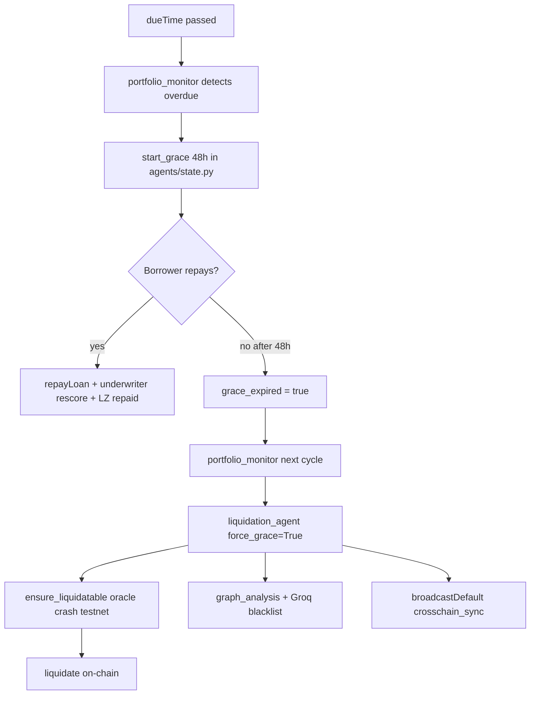

### Calendar Overdue vs On-Chain Enforcement

Loans store `dueTime = startTime + durationDays * 1 day` at creation. **Contracts do not check `dueTime` in `liquidate()` or `repayLoan()`.** The loan stays `active = true` after the due date until something closes it.

Calendar enforcement is **entirely agent-side** via `portfolio_monitor`:

| Phase | Contract state | Agent action |
|-------|---------------|--------------|
| Before due date | Loan active | Monitor reads LTV only |
| `now > dueTime` | Loan still active | `start_grace(loan_id)` — 48h timer in `agents/state.py` |
| During grace | Loan still active; borrower can `repayLoan()` | Monitor logs `grace: started`; Groq `flag_liquidation=true` |
| Grace expired | Loan still active | Monitor calls `liquidation_agent` with `force_grace=True` |
| After liquidation | Loan closed; default recorded | See liquidation agent phases below |

On testnet, if LTV is still below 85% when grace expires, **`ensure_liquidatable()`** (`agents/test_default.py`) lowers the mock Chainlink WETH/USD feed until `getCurrentLTV >= 8500` — because `liquidate()` only accepts LTV-based triggers, not calendar overdue alone.

### Grace Period and Portfolio Monitor

**File:** `agents/state.py`  
**Duration:** `LIQUIDATION_GRACE_HOURS` (default **48 hours**)

When `portfolio_monitor._monitor_loan()` detects `now > dueTime`:

1. **`start_grace(loan_id)`** — writes `{ started_at: unix_timestamp, breach: "covenant_overdue" }` to in-memory `_grace` dict. **Not on-chain.**
2. **`review_monitor_escalation(..., overdue=true)`** — Groq fallback sets `flag_liquidation=true` immediately for overdue loans.
3. Each subsequent 300s poll: `grace_expired(loan_id)` checks `now >= started_at + 48h`.
4. If grace not expired: monitor continues LTV checks (health warnings still fire if ETH drops during grace).
5. If grace expired: monitor calls `LiquidationAgent.execute_liquidation(loan_id, force_grace=True)`.

During grace the borrower can still **`repayLoan()`** — normal on-chain repay. That triggers `runPostRepayPipeline()` (re-score → underwriter rescore → crosschain_sync repaid). Grace state becomes irrelevant because the loan no longer exists.

### Liquidation Agent and Cross-Chain Blacklist

After grace expires without repayment, the **same liquidation agent** used for price-crash scenarios runs with `force_grace=True`:

**Step 1 — Force liquidatable (testnet bridge):**

```python
# agents/test_default.py → ensure_liquidatable()
# Lowers MockChainlinkFeed ETH/USD until LTV >= liquidationThreshold (8500 bps)
crash_eth_oracle(target_price)  # agent must own feed or deployer key
```

**Step 2 — `lending.liquidate(loanId)`** — agent signs; collateral seized; hub `recordDefault(borrower)`.

**Step 3 — Sybil ring containment (hub):**

- `get_transaction_counterparties(borrower, depth=1)` — transfer graph from Alchemy.
- `identify_linked_wallets()` — confidence: high / medium / low.
- `check_existing_credflow_loans(linked)` — find other open loans in the ring.
- `review_liquidation_blacklist()` — Groq + rule: all `confidence=high` must be blacklisted.
- `sbt.blacklistLinkedWallets(high_conf | groq_set, defaulter)` — on-chain.
- `emitHealthWarning` on each at-risk linked loan still active.

**Step 4 — LayerZero (`hub.broadcast_default`):**

- `MSG_DEFAULT` to Arbitrum (40231) and Base (40245) for defaulter.
- Repeat for each blacklisted linked wallet.
- Spoke effect per wallet: `defaultBlacklist=true`, `spokeScores=310`, `loanActiveMirror=false`.

| Layer | During grace (0–48h) | After liquidation agent runs |
|-------|---------------------|------------------------------|
| Contracts | Loan active; no time enforcement | Loan closed; collateral seized; hub `defaultCount++` |
| portfolio_monitor | Grace timer ticking; overdue flagged to Groq | Hands off to liquidation; clears grace on success |
| liquidation_agent | Not invoked yet | liquidate → graph → blacklist → LZ default |
| crosschain_sync | No LZ messages | `broadcastDefault` per bad wallet |
| LayerZero | Nothing | `MSG_DEFAULT` on all spokes |

---

## LayerZero Cross-Chain Messaging

Your CredScore should follow you wherever you borrow. Robinhood testnet holds the authoritative **CredScore SBT**, but many users' DeFi history and preferred borrow markets live on Arbitrum and Base. LayerZero V2 carries verified credit state — score, active-loan lock, repaid clear, default blacklist — so every lending contract enforces the **same underwritten identity** without trusting a centralized API or duplicating the scoring pipeline on each chain.

LayerZero is the **cross-chain delivery layer** for CredFlow credit. Robinhood testnet owns the authoritative record in `CredScoreSBT`. Arbitrum Sepolia and Base Sepolia need that state — score, loan lock, blacklist — without minting their own SBTs. LayerZero V2 delivers signed, verifiable messages so `CredFlowSpokeLending` can enforce the same rules locally.

### Why LayerZero

Without cross-chain sync, a borrower could:

1. Mint a CredScore SBT at 720 on Robinhood testnet.
2. Borrow on Arbitrum using a stale or fabricated local score — ignoring the wallet history and underwriting that produced the real score.
3. Take a **second** loan on Base while a Robinhood loan is still active.

CredFlow prevents this by mirroring authoritative credit state into each chain's `CredFlowOApp`. Lending contracts read `ICredFlowCreditRegistry` (`getScore`, `isLoanActive`, `isBlacklisted`) — all backed by LayerZero-delivered state from the underwriter and sync agents, not user claims.

Robinhood testnet is an **official LayerZero V2 chain** (EID 40451). No custom endpoint deployment — CredFlow wires peers to Arbitrum Sepolia (40231) and Base Sepolia (40245) using standard EndpointV2 contracts.

### Cross-Chain Credit Topology

Credit is **issued once** on Robinhood testnet (CredScore SBT + underwriter agent) and **mirrored** to Arbitrum and Base lending markets via LayerZero. Users experience one CredScore; contracts on each chain read the same synchronized state.

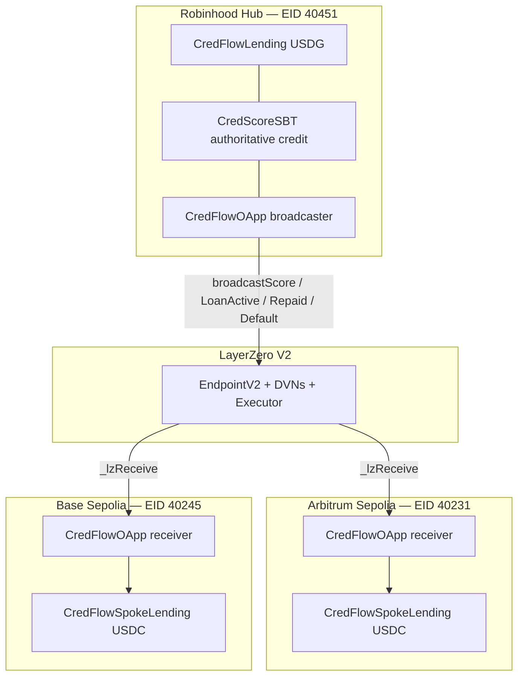

**Direction:** Robinhood testnet → Arbitrum and Base only. Remote chains never broadcast back. All credit mutations originate where the SBT lives (underwriter agent); other markets are synchronized read replicas updated by the cross-chain sync agent via LayerZero.

### Chain and Endpoint Reference

From `layerzero/config.json` and deployed addresses in [Contracts](#contracts):

| Chain | Chain ID | LZ EID | EndpointV2 | CredFlowOApp role |
|-------|----------|--------|------------|-------------------|
| Robinhood testnet (hub) | 46630 | **40451** | [0x3aCAAf...eBFe32](https://explorer.testnet.chain.robinhood.com/address/0x3aCAAf60502791D199a5a5F0B173D78229eBFe32) | Broadcaster + reads SBT |
| Arbitrum Sepolia | 421614 | **40231** | `0x6EDCE65403992e310A62460808c4b910D972f10f` | Receiver only |
| Base Sepolia | 84532 | **40245** | `0x6EDCE65403992e310A62460808c4b910D972f10f` | Receiver only |

Robinhood testnet LZ infrastructure also includes SendUln302, ReceiveUln302, Executor, and four DVNs (LayerZero Labs, Nethermind, Horizen, Paxos) — see `layerzero/config.json` for full addresses.

### CredFlowOApp Contract

**File:** `contracts/CredFlowOApp.sol` — extends LayerZero `OApp` + implements `ICredFlowCreditRegistry` on spokes.

**Hub deployment:** `sbtContract` points to live `CredScoreSBT`. Broadcast functions read hub state and send LZ packets.

**Spoke deployment:** `sbtContract = address(0)`. `_lzReceive` writes only to local mappings — never calls hub SBT on-chain.

**Hub broadcast functions** (all `onlyRole(AGENT_ROLE)`, payable for LZ fees):

| Function | Payload | Destinations |
|----------|---------|--------------|
| `broadcastScore(dstChainIds, wallet, score, options)` | `abi.encode(MSG_SCORE_UPDATE, wallet, score)` | Per EID in array |
| `broadcastLoanActive(dstChainIds, wallet, options)` | `abi.encode(MSG_LOAN_ACTIVE, wallet, 0)` | Per EID |
| `broadcastRepaid(dstChainIds, wallet, options)` | `abi.encode(MSG_REPAID, wallet, 0)` | Per EID |
| `broadcastDefault(dstChainIds, wallet, options)` | `abi.encode(MSG_DEFAULT, wallet, 310)` | Per EID |

Fee splitting: `msg.value` is divided evenly across `dstChainIds.length` inside each broadcast loop.

**Spoke receive handler** (`_lzReceive`):

```solidity
(uint8 msgType, address wallet, uint16 data) = abi.decode(message, (uint8, address, uint16));
```

### Message Types and Spoke State

| Constant | ID | `data` field meaning | Spoke state mutations |
|----------|-----|----------------------|------------------------|
| `MSG_SCORE_UPDATE` | 1 | Credit score (uint16) | `spokeScores[wallet] = data` |
| `MSG_LOAN_ACTIVE` | 2 | Unused (0) | `loanActiveMirror[wallet] = true` |
| `MSG_DEFAULT` | 3 | Penalty score (always **310** on broadcast) | `defaultBlacklist[wallet] = true`; `spokeScores[wallet] = 310`; `loanActiveMirror[wallet] = false` |
| `MSG_REPAID` | 4 | Unused (0) | `loanActiveMirror[wallet] = false` |

**Registry interface** (`ICredFlowCreditRegistry`) exposes:

- `getScore(wallet)` → `spokeScores[wallet]` (0 if never synced)
- `isBlacklisted(wallet)` → `defaultBlacklist[wallet]`
- `isLoanActive(wallet)` → `loanActiveMirror[wallet]`

`CredFlowSpokeLending.requestLoan()` checks all three before allowing USDC borrow.

### Message Flow by Lifecycle Event

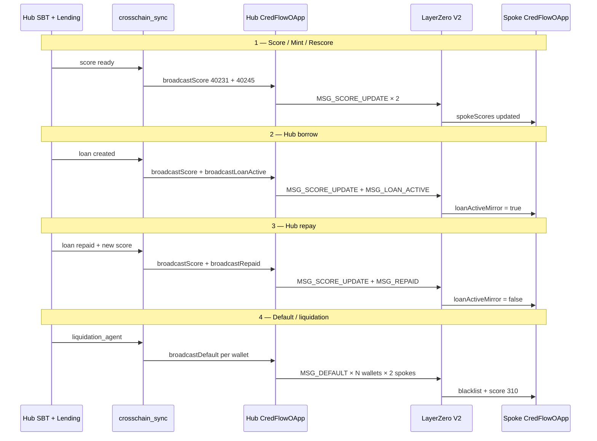

| Lifecycle event | Who triggers LZ | Messages sent | Spoke borrow effect |
|-----------------|-----------------|---------------|---------------------|
| Score complete (no mint yet) | `triggerSyncScore()` → `sync_wallet_score()` | `MSG_SCORE_UPDATE` to both spokes | Score available for spoke LTV/rate tiers |
| SBT mint / underwrite | Same after `underwriter` writes SBT | `MSG_SCORE_UPDATE` | Same |
| Hub `requestLoan()` | `triggerSyncLoanCreated()` → `sync_wallet_loan_active()` | `MSG_SCORE_UPDATE` + `MSG_LOAN_ACTIVE` | Spoke borrow **blocked** (`isLoanActive`) |
| Spoke `requestLoan()` | **None** | No LZ | Local loan only; hub SBT unchanged |
| Hub `repayLoan()` | `runPostRepayPipeline()` → `sync_wallet_repaid_with_score()` | `MSG_SCORE_UPDATE` + `MSG_REPAID` | Spoke borrow **unblocked** |
| Liquidation / default | `liquidation_agent` → `hub.broadcast_default()` | `MSG_DEFAULT` per defaulter + linked wallets | Blacklisted; score crushed to 310 |
| Rate optimizer batch | `crosschain_sync` catch-up | Stale `MSG_SCORE_UPDATE` only | Keeps spoke scores fresh |

### Crosschain Sync Agent as Broadcaster

The **crosschain_sync agent** is the **only** component that calls hub `CredFlowOApp` broadcast functions. No frontend wallet, no borrower EOA — only `AGENT_PRIVATE_KEY` with `AGENT_ROLE` on hub OApp.

**Files:**

- `agents/crosschain_sync.py` — HTTP handlers (`/agents/sync-score`, `/agents/sync-loan`, batch sync)
- `agents/sync_service.py` — `sync_wallet_score()`, `sync_wallet_loan_active()`, `sync_wallet_repaid_with_score()`
- `agents/base.py` — `CredFlowAgent.broadcast_score()`, `broadcast_loan_active()`, `broadcast_repaid()`, `broadcast_default()`
- `frontend/src/lib/agent-client.ts` — `triggerSyncScore()`, `triggerSyncLoanCreated()`, `triggerSyncLoanRepaid()`, `triggerClearSpokeLoanActive()`

**Per-spoke tx pattern:** Each broadcast sends **one destination EID per transaction** (not a single tx with both EIDs), so a full hub-borrow sync produces **four** hub txs: score→Arb, score→Base, loanActive→Arb, loanActive→Base.

**Edge case — borrow without active loan:** If `sync_wallet_loan_active()` finds `activeLoanId(wallet) == 0` on hub, it broadcasts **repaid-clear** instead of loan-active — heals inconsistent state.

**Liquidation path:** `liquidation_agent` calls `hub.broadcast_default()` directly (not via sync_service). Each blacklisted address gets its own default broadcast to both spokes.

### Options Encoding and Fees

LayerZero V2 executors require **non-empty options bytes** specifying destination gas. Empty `0x` options fail on testnet and mainnet executors.

**Encoding:**

- Python: `agents/lz_options.py` → `build_lz_options(gas_limit=200_000)`
- JavaScript: `layerzero/buildLzOptions.js` → `buildLzOptions(200000)`
- Used by agents (`agents/base.py`) and standalone scripts (`scripts/lz-broadcast-score.js`, `lz-broadcast-loan-active.js`)

**Fees:**

- `CredFlowAgent.lz_fee_for_broadcast(dst_count)` quotes native ETH required per destination.
- Agent wallet must hold Robinhood testnet ETH for messaging fees **in addition** to gas for the hub tx itself.
- `broadcast*` functions are `payable`; fee forwarded to LayerZero Endpoint via `_lzSend`.

**Quoting:** `scripts/lz-quote-sync.js` and `scripts/lz-quote-debug.js` preview fees before manual broadcasts.

### Peer Wiring and DVNs

Before any message delivers, hub and spoke OApps must trust each other as LZ peers.

**Setup scripts:**

| Script | Chain | Action |
|--------|-------|--------|
| `npm run lz:set-peers` | Hub | `setPeer(40231, spokeArbOAppBytes32)` + `setPeer(40245, spokeBaseOAppBytes32)` |
| `scripts/set-peer-spoke.js` | Each spoke | `setPeer(40451, hubOAppBytes32)` |

**Verification:** `npm run lz:status` — confirms peer addresses and pathway config.

**DVNs on Robinhood testnet** (from `layerzero/config.json`): LayerZero Labs, Nethermind, Horizen, Paxos. Messages are verified by the configured DVN set before executor delivery on destination.

**Security model:** Spoke `_lzReceive` only accepts packets from the configured hub peer EID. Spoke OApps cannot be tricked by arbitrary senders — OApp peer mapping enforces source.

### Delivery Latency and Stale Locks

LayerZero delivery is **asynchronous**. A hub `broadcastRepaid` tx succeeding does **not** mean spokes have cleared `loanActiveMirror` yet. Arbitrum and Base may update at different times.

**Frontend handling** (`frontend/src/lib/loan-chain-enrich.ts`):

| `lzLockKind` | Meaning | UX |
|--------------|---------|-----|
| `none` | No cross-chain lock | Normal eligibility |
| `hub_mirror` | Hub has active loan | All spokes blocked even if one spoke's LZ flag lags |
| `lz_clear_pending` | Hub repaid but spoke mirror still `loanActive` | Borrow waits for `MSG_REPAID` delivery |

**Fallback clear:** `triggerClearSpokeLoanActive()` in `agent-client.ts` sends **repaid-only** `broadcastRepaid` if the full score+repaid sync fails. `POST /api/loans/clear-lz-lock` exposes manual recovery when `lzLockKind === "lz_clear_pending"`. Cooldown and in-flight guards prevent spam (`lz_clear_cooldown`, `lz_clear_in_flight`).

**Operational recovery scripts:**

- `scripts/lz-broadcast-score.js` — manual score push
- `scripts/lz-broadcast-loan-active.js` — manual loan lock
- `npm run lz:status` — pathway health check

**Batch catch-up:** `crosschain_sync` scheduler can replay stale scores (Groq `review_sync_priority()` ranks wallets) so spoke `spokeScores` do not drift far from hub SBT after missed events.

### LayerZero vs Hub SBT — Source of Truth

| Data | Authoritative source | Spoke copy |
|------|---------------------|------------|
| Credit score | `CredScoreSBT.score` on hub | `CredFlowOApp.spokeScores` via `MSG_SCORE_UPDATE` |
| Loan active | `CredScoreSBT.loanActive` on hub | `CredFlowOApp.loanActiveMirror` via `MSG_LOAN_ACTIVE` / `MSG_REPAID` |
| Default / blacklist | `CredScoreSBT.blacklisted` on hub | `CredFlowOApp.defaultBlacklist` via `MSG_DEFAULT` |
| Open loan collateral/LTV | Hub `CredFlowLending` loans mapping | Spoke local loans only |

If LZ fails silently, hub and spoke **diverge**. The UI treats hub loan existence as the hard lock on spokes (`hub_mirror`) to avoid double-borrow even when LZ is slow. After repay, spokes depend on `MSG_REPAID` — hence `lz_clear_pending` and manual clear routes.

---

## Contracts Overview

Smart contracts implement the on-chain half of CredFlow's credit product: the SBT that stores your score, lending pools that honor score-based LTV tiers, and the LayerZero registry that keeps every chain aligned with what the agents underwrote.

High-level roles of each Solidity module in `contracts/`.

### CredScoreSBT

**File:** `contracts/CredScoreSBT.sol`

ERC721 **soulbound** token storing the borrower's credit profile on the hub:

- `score`, `borrowSubScore`, `walletSubScore`
- `loanActive`, `loanStatus`, `totalLoans`, `defaultCount`
- `shapCid` (IPFS pointer to SHAP explanation)
- `blacklisted` mapping + `blacklistLinkedWallets()` for sybil rings
- Mutators (`setLoanActive`, `setLoanRepaid`, `recordDefault`) restricted to `AGENT_ROLE` / lending contract

### CredScoreEngine

**File:** `contracts/CredScoreEngine.sol`

On-chain score formula combining ML default probability (bps) with Reclaim bank balance capacity. Calls SBT `mintSBT()` / `updateScore()` after computing final score. Invoked by the underwriter agent when Reclaim is enabled.

### CredFlowLending

**File:** `contracts/CredFlowLending.sol`

Hub lending pool interface:

- `requestLoan(borrowAmount, collateralToken, collateralAmount, durationDays)` — reads SBT, enforces LTV, pulls collateral, mints loan, sets SBT loan active, transfers USDG.
- `repayLoan(loanId)` — interest + principal in, collateral out, SBT loan repaid.
- `liquidate(loanId)` — LTV ≥ 85%; collateral seizure; SBT default recorded.
- `emitHealthWarning(loanId)` — audit event at 75%+ LTV.
- `getLTVForScore(score)` / `getRateForScore(score)` — tier tables.
- `getCurrentLTV(loanId)` — live LTV from oracle.

### CredFlowSpokeLending

**File:** `contracts/CredFlowSpokeLending.sol`

Identical borrow/repay/liquidate mechanics to hub lending, but:

- Credit registry is `CredFlowOApp` (implements `ICredFlowCreditRegistry`) instead of SBT.
- Borrow asset is USDC.
- No SBT mutations on borrow/repay/liquidate.
- Rejects borrow when `creditRegistry.isLoanActive()` (hub LZ lock).

### CredFlowLP

**File:** `contracts/CredFlowLP.sol`

Liquidity pool for borrow assets (USDG on hub, USDC on spokes). Tracks `totalDeposited`, `totalBorrowed`, `utilizationRate`. Rate optimizer reads utilization to adjust `baseRate`.

### CredFlowOApp

**File:** `contracts/CredFlowOApp.sol`

LayerZero V2 OApp — hub broadcasts credit state, spokes receive and mirror. Full message spec, agent broadcaster flow, peer wiring, fees, and stale-lock handling are documented in [LayerZero Cross-Chain Messaging](#layerzero-cross-chain-messaging).

Summary: four message types (`MSG_SCORE_UPDATE`, `MSG_LOAN_ACTIVE`, `MSG_DEFAULT`, `MSG_REPAID`) update `spokeScores`, `loanActiveMirror`, and `defaultBlacklist` on spokes. Hub references `CredScoreSBT`; spoke sets `sbtContract = address(0)`. Broadcast functions require `AGENT_ROLE` and native ETH for LZ fees.

### ChainlinkOracle

**File:** `contracts/ChainlinkOracle.sol`

Hub oracle implementing `ILTVOracle`. Maps token → Chainlink-compatible price feed. Used by lending for `getValueUSD(collateralToken, amount)`.

### ChainlinkMirrorFeed

**File:** `contracts/ChainlinkMirrorFeed.sol`

Spoke price feed that mirrors mainnet Chainlink ETH/USD. An off-chain script (`scripts/sync-spoke-oracle.js`) pushes mainnet prices to testnet feeds so collateral valuations track real markets.

### ICredFlowCreditRegistry

**File:** `contracts/interfaces/ICredFlowCreditRegistry.sol`

Interface implemented by `CredFlowOApp` on spokes: `getScore()`, `isBlacklisted()`, `isLoanActive()`. Allows `CredFlowSpokeLending` to read mirrored hub credit without a local SBT.

---

## Agent-Contract Interaction Matrix

The five agents are how CredFlow's credit intelligence becomes on-chain reality. This matrix maps **which agent touches which contract**, with what function, and whether LayerZero is involved — use it when tracing a borrower action from score → mint → borrow → repay → default.

### Write Access Matrix

| Agent | Contract | Functions called | LZ broadcast | When |
|-------|----------|------------------|--------------|------|
| **underwriter** | `CredScoreEngine` | `mintScore(...)` | No (caller syncs) | First mint with Reclaim |
| **underwriter** | `CredScoreSBT` | `mintSBT()`, `updateScore()` | No | Mint / rescore |
| **crosschain_sync** | Hub `CredFlowOApp` | `broadcastScore` | Yes — `MSG_SCORE_UPDATE` | After score, mint, rescore, borrow, batch |
| **crosschain_sync** | Hub `CredFlowOApp` | `broadcastLoanActive` | Yes — `MSG_LOAN_ACTIVE` | After hub borrow |
| **crosschain_sync** | Hub `CredFlowOApp` | `broadcastRepaid` | Yes — `MSG_REPAID` | After hub repay / stale lock clear |
| **crosschain_sync** | Hub `CredFlowOApp` | `broadcastDefault` | Yes — `MSG_DEFAULT` | Only via liquidation_agent delegation |
| **portfolio_monitor** | `CredFlowLending` / `CredFlowSpokeLending` | `getCurrentLTV`, `getLoan` (read) | No | Every 300s poll |
| **portfolio_monitor** | `CredFlowLending` | `emitHealthWarning(loanId)` | No | LTV ≥ 75% threshold |
| **liquidation_agent** | `CredFlowLending` / `CredFlowSpokeLending` | `liquidate(loanId)` | No | LTV ≥ 85% or grace expired |
| **liquidation_agent** | `CredScoreSBT` | `blacklistLinkedWallets(addrs, defaulter)` | No | Hub default + sybil ring |
| **liquidation_agent** | Hub `CredFlowOApp` | `broadcastDefault` (via `hub.broadcast_default`) | Yes — `MSG_DEFAULT` | Per defaulter + linked wallets |
| **rate_optimizer** | `CredFlowLP` | `getUtilization()`, reads pool state | No | Every 3600s |
| **rate_optimizer** | `CredFlowLending` / `CredFlowSpokeLending` | `setBaseRate(newRate)` | No | Utilization-driven adjustment |

### Read-Only Agent Dependencies

| Agent | Reads from | Purpose |
|-------|-----------|---------|
| **underwriter** | Scoring API snapshot | Hard rules + Groq borderline |
| **crosschain_sync** | `CredScoreSBT.getProfile()` | Score to broadcast |
| **crosschain_sync** | `CredFlowLending.activeLoanId()` | Loan-active vs repaid-clear decision |
| **portfolio_monitor** | `ChainlinkOracle` / spoke mirror feed | Collateral USD value |
| **portfolio_monitor** | `CredScoreSBT` / spoke `CredFlowOApp` | Borrower score tier |
| **liquidation_agent** | Alchemy transfer graph (`ml/graph_analysis.py`) | Linked wallet discovery |
| **rate_optimizer** | `CredFlowLP.totalDeposited`, `totalBorrowed` | Utilization bps |

### User vs Agent Transaction Boundaries

| Action | Signer | Agent involvement |
|--------|--------|-------------------|
| Build score | Server wallet / API | None on-chain until mint |
| Mint SBT | **underwriter** (`AGENT_PRIVATE_KEY`) | Then **crosschain_sync** for LZ |
| Hub borrow | User (`FRONTEND_PRIVATE_KEY` in demo) | **crosschain_sync** after tx confirms |
| Spoke borrow | User | **None** — no LZ |
| Hub/spoke repay | User | **underwriter** rescore + **crosschain_sync** on hub repay only |
| Liquidation | **liquidation_agent** | Full pipeline including LZ default |
| Health warning | **portfolio_monitor** | `emitHealthWarning` only |

### Contract-to-Contract Calls (No Agent)

These happen inside a single user transaction — agents do not intermediate:

| Caller | Callee | Trigger |
|--------|--------|---------|
| `CredFlowLending` | `CredScoreSBT` | `setLoanActive` on borrow; `setLoanRepaid` on repay; `recordDefault` on liquidate |
| `CredFlowLending` | `CredFlowLP` | `recordBorrow` / `recordRepayment` |
| `CredFlowLending` | `ChainlinkOracle` | `getValueUSD` for LTV |
| `CredFlowSpokeLending` | `CredFlowOApp` | `getScore`, `isLoanActive`, `isBlacklisted` via registry interface |
| Hub `CredFlowOApp` | LayerZero Endpoint | `_lzSend` on broadcast |
| Spoke `CredFlowOApp` | LayerZero Endpoint | `_lzReceive` on delivery |

### Event → Agent → Contract Flow (Consolidated)

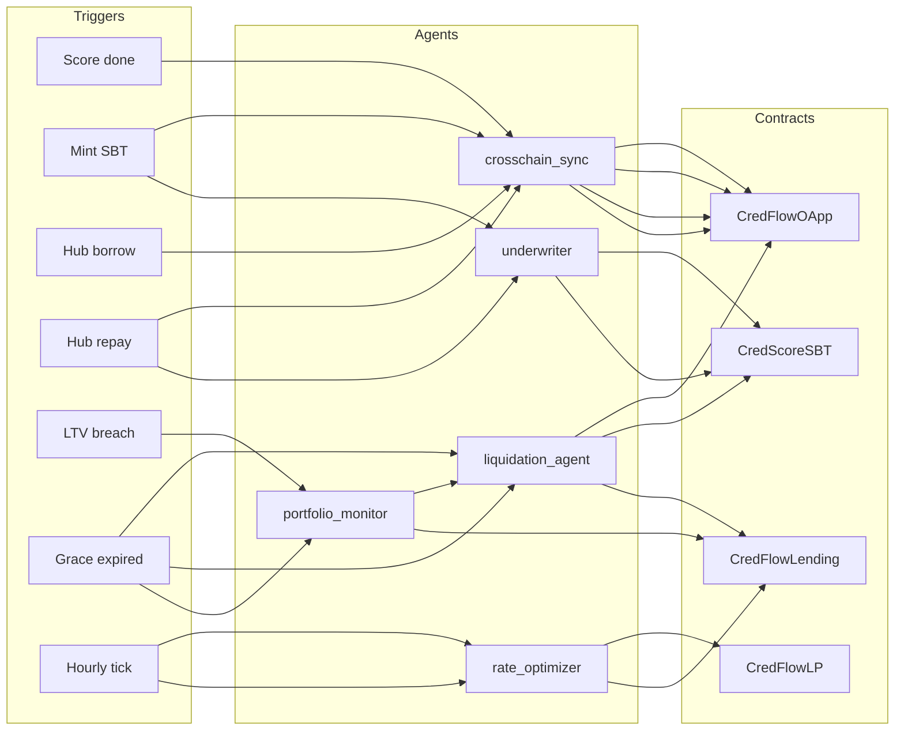

---

## Conclusion

CredFlow is a **credit product powered by depth, not collateral size alone**:

- **Wallet intelligence** — 37 ML features from Aave, Morpho, CredFlow loan history, and Alchemy transfer graphs, plus R-GCN sybil detection and SHAP explainability.
- **Bank path for newcomers** — Reclaim zkTLS folds verified bank balance into the on-chain score formula so Web3-new users can get an accurate CredScore without years of DeFi history.
- **Portable CredScore SBT** — one soulbound credit identity on Robinhood testnet, synced to every borrow market.
- **Undercollateralized loans** — score-driven LTV tiers (40–85%) and rate tiers on Robinhood (USDG), Arbitrum (USDC), and Base (USDC).
- **Five agents** — underwriter, cross-chain sync, portfolio monitor, liquidation, and rate optimizer automate minting, propagation, health checks, enforcement, and pool economics around the clock.
- **LayerZero V2** — keeps every lending contract aligned with the same score, loan lock, repaid clear, and default blacklist — no double-borrows, no stale credit.

The system is live on testnet. Production hardening would add explicit calendar-overdue liquidation in contracts, persistent grace state, mainnet oracle feeds, and wallet-connect UX alongside the server-side demo wallet.

---

*CredFlow — deep credit intelligence and autonomous agents for the next era of on-chain lending.*
