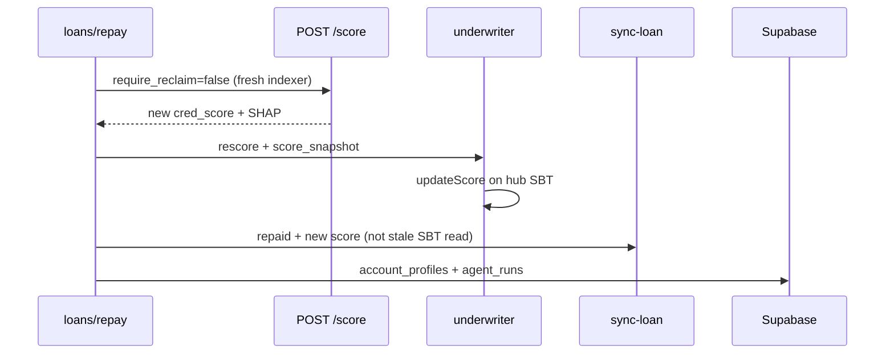

# CredFlow agents (no OZ Defender)

Run three terminals for the full stack:

```powershell
# Terminal 1 — ML scoring API
npm run ml:serve:api-only

# Terminal 2 — Next.js frontend
npm run frontend:dev

# Terminal 3 — Agent scheduler (monitor, rates, LZ sync batch)
npm run agents:serve
```

## What each layer does

| Trigger | Agent | How it runs |
|---------|-------|-------------|
| Score / mint | Underwriter + Cross-Chain Sync | Next.js `api_hook` on `/api/score`, `/api/mint` |
| Hub borrow | Cross-Chain Sync (`loan_created`) | Next.js `api_hook` on `/api/loans/borrow` |
| Any-chain repay | Underwriter + Cross-Chain Sync | Next.js `api_hook` on `/api/loans/repay` (hub, arbitrum, base) |
| Health checks | Portfolio Monitor | `agents:serve` every `AGENT_MONITOR_INTERVAL_SEC` (default 5 min) |
| Pool rates | Rate Optimizer | `agents:serve` every `AGENT_RATES_INTERVAL_SEC` (default 1 h) |
| LZ catch-up | Cross-Chain Sync batch | `agents:serve` every `AGENT_SYNC_INTERVAL_SEC` (default 1 h) |
| Manual demo | Any | Agents tab → Run monitor / Run sync |

All runs log to Supabase `agent_runs` + `agent_log_lines` (visible in the **Agents** tab).

## File run logs (verification)

When you run `npm run agents:serve`, a session folder is created under `logs/agent-runs/sessions/`.
While that session is active, **every agent run** is also written as a separate JSON file:

| Subfolder | What gets logged |
|-----------|------------------|
| `agent-runs/` | `underwriter`, `crosschain_sync`, `portfolio_monitor`, `rate_optimizer` (scheduler + api_hook) |
| `score-runs/` | ML `POST /score` (including post-repay re-score) |
| `api-hooks/` | Next.js orchestration: `/api/score`, `/api/mint`, `/api/loans/borrow`, `/api/loans/repay` |

The scheduler prints the session path on startup, e.g.:

```
Run logs → logs/agent-runs/sessions/20250609-143022-agents-serve
```

`session.json` in that folder tracks run counts. Ask the agent to read these files after a test cycle to cross-check score → mint → borrow → repay.

**Tip:** Start `agents:serve` before testing so score/mint/repay agent files land in the same session.

## Environment

Root `.env` (scheduler reads this via `dotenv`):

```env
AGENT_PRIVATE_KEY=0x...
AGENT_MONITOR_INTERVAL_SEC=300
AGENT_RATES_INTERVAL_SEC=3600
AGENT_SYNC_INTERVAL_SEC=3600
AGENT_MONITOR_CHAINS=hub,arbitrum,base
NEXT_PUBLIC_SUPABASE_URL=https://xxx.supabase.co
SUPABASE_SERVICE_ROLE_KEY=...
OZ_DEFENDER_SECRET=
```

`AGENT_PRIVATE_KEY` must be funded on **Robinhood hub** for LayerZero broadcast fees.

Optional: set `MONITOR_RPC_BASE=https://sepolia.base.org` if Alchemy `eth_getLogs` fails on Base Sepolia during portfolio monitor runs.

## Post-repay flow (all chains)

After `repayLoan` on **hub**, **Arbitrum**, or **Base**, `/api/loans/repay` runs the same agent pipeline:



**Requirements**

- ML API must be running: `npm run ml:serve:api-only` (scoring + `/agents/*` on port 8000).
- `AGENT_PRIVATE_KEY` funded on hub for LZ broadcast fees.
- Spoke repays are indexed via `loanCounter` scan (`indexer/spoke_credflow_pipeline.py`) so `credflow_repay_count` updates for XGBoost re-score.

The Loans tab shows score before/after, underwriter tx, and LZ broadcast hashes. Full run logs appear in the **Agents** tab (`trigger_event: loan_repaid`, `trigger_source: api_hook`).

## One-shot CLI (optional)

```powershell
npm run agent:monitor
npm run agent:rates
npm run agent:sync
```

These run once and exit; `agents:serve` runs them on a loop.
